| **Rank** | **Hand** | **Pokemon** | **Move** |
|----------|-------------|----------|----------|
| 1 |  AAo | [Treecko](https://bulbapedia.bulbagarden.net/wiki/Treecko_(Pokémon)#Sprites)  | [slam](https://bulbapedia.bulbagarden.net/wiki/Slam_(move)#In_other_generations)  |
| 2 |  AKo | [Torchic](https://bulbapedia.bulbagarden.net/wiki/Torchic_(Pokémon)#Sprites)  | [mirror-move](https://bulbapedia.bulbagarden.net/wiki/Mirror_Move_(move)#In_other_generations)  |
| 3 |  AQo | [Mudkip](https://bulbapedia.bulbagarden.net/wiki/Mudkip_(Pokémon)#Sprites)  | [ice-ball](https://bulbapedia.bulbagarden.net/wiki/Ice_Ball_(move)#In_other_generations)  |
| 4 |  AJo | [Poochyena](https://bulbapedia.bulbagarden.net/wiki/Poochyena_(Pokémon)#Sprites)  | [poison-fang](https://bulbapedia.bulbagarden.net/wiki/Poison_Fang_(move)#In_other_generations)  |
| 5 |  ATo | [Mightyena](https://bulbapedia.bulbagarden.net/wiki/Mightyena_(Pokémon)#Sprites)  | [swagger](https://bulbapedia.bulbagarden.net/wiki/Swagger_(move)#In_other_generations)  |
| 6 |  A9o | [Zigzagoon](https://bulbapedia.bulbagarden.net/wiki/Zigzagoon_(Pokémon)#Sprites)  | [pin-missile](https://bulbapedia.bulbagarden.net/wiki/Pin_Missile_(move)#In_other_generations)  |
| 7 |  A8o | [Linoone](https://bulbapedia.bulbagarden.net/wiki/Linoone_(Pokémon)#Sprites)  | [belly-drum](https://bulbapedia.bulbagarden.net/wiki/Belly_Drum_(move)#In_other_generations)  |
| 8 |  A7o | [Wurmple](https://bulbapedia.bulbagarden.net/wiki/Wurmple_(Pokémon)#Sprites)  | [string-shot](https://bulbapedia.bulbagarden.net/wiki/String_Shot_(move)#In_other_generations)  |
| 9 |  A6o | [Beautifly](https://bulbapedia.bulbagarden.net/wiki/Beautifly_(Pokémon)#Sprites)  | [morning-sun](https://bulbapedia.bulbagarden.net/wiki/Morning_Sun_(move)#In_other_generations)  |
| 10 |  A5o | [Dustox](https://bulbapedia.bulbagarden.net/wiki/Dustox_(Pokémon)#Sprites)  | [moonlight](https://bulbapedia.bulbagarden.net/wiki/Moonlight_(move)#In_other_generations)  |
| 11 |  A4o | [Lotad](https://bulbapedia.bulbagarden.net/wiki/Lotad_(Pokémon)#Sprites)  | [razor-leaf](https://bulbapedia.bulbagarden.net/wiki/Razor_Leaf_(move)#In_other_generations)  |
| 12 |  A3o | [Lombre](https://bulbapedia.bulbagarden.net/wiki/Lombre_(Pokémon)#Sprites)  | [fake-out](https://bulbapedia.bulbagarden.net/wiki/Fake_Out_(move)#In_other_generations)  |
| 13 |  A2o | [Ludicolo](https://bulbapedia.bulbagarden.net/wiki/Ludicolo_(Pokémon)#Sprites)  | [nature-power](https://bulbapedia.bulbagarden.net/wiki/Nature_Power_(move)#In_other_generations)  |
| 14 |  KKo | [Seedot](https://bulbapedia.bulbagarden.net/wiki/Seedot_(Pokémon)#Sprites)  | [razor-wind](https://bulbapedia.bulbagarden.net/wiki/Razor_Wind_(move)#In_other_generations)  |
| 15 |  KQo | [Nuzleaf](https://bulbapedia.bulbagarden.net/wiki/Nuzleaf_(Pokémon)#Sprites)  | [extrasensory](https://bulbapedia.bulbagarden.net/wiki/Extrasensory_(move)#In_other_generations)  |
| 16 |  KJo | [Shiftry](https://bulbapedia.bulbagarden.net/wiki/Shiftry_(Pokémon)#Sprites)  | [pound](https://bulbapedia.bulbagarden.net/wiki/Pound_(move)#In_other_generations)  |
| 17 |  KTo | [Taillow](https://bulbapedia.bulbagarden.net/wiki/Taillow_(Pokémon)#Sprites)  | [sky-attack](https://bulbapedia.bulbagarden.net/wiki/Sky_Attack_(move)#In_other_generations)  |
| 18 |  K9o | [Swellow](https://bulbapedia.bulbagarden.net/wiki/Swellow_(Pokémon)#Sprites)  | [endeavor](https://bulbapedia.bulbagarden.net/wiki/Endeavor_(move)#In_other_generations)  |
| 19 |  K8o | [Wingull](https://bulbapedia.bulbagarden.net/wiki/Wingull_(Pokémon)#Sprites)  | [gust](https://bulbapedia.bulbagarden.net/wiki/Gust_(move)#In_other_generations)  |
| 20 |  K7o | [Pelipper](https://bulbapedia.bulbagarden.net/wiki/Pelipper_(Pokémon)#Sprites)  | [wing-attack](https://bulbapedia.bulbagarden.net/wiki/Wing_Attack_(move)#In_other_generations)  |
| 21 |  K6o | [Ralts](https://bulbapedia.bulbagarden.net/wiki/Ralts_(Pokémon)#Sprites)  | [dream-eater](https://bulbapedia.bulbagarden.net/wiki/Dream_Eater_(move)#In_other_generations)  |
| 22 |  K5o | [Kirlia](https://bulbapedia.bulbagarden.net/wiki/Kirlia_(Pokémon)#Sprites)  | [imprison](https://bulbapedia.bulbagarden.net/wiki/Imprison_(move)#In_other_generations)  |
| 23 |  K4o | [Gardevoir](https://bulbapedia.bulbagarden.net/wiki/Gardevoir_(Pokémon)#Sprites)  | [hypnosis](https://bulbapedia.bulbagarden.net/wiki/Hypnosis_(move)#In_other_generations)  |
| 24 |  K3o | [Surskit](https://bulbapedia.bulbagarden.net/wiki/Surskit_(Pokémon)#Sprites)  | [mud-shot](https://bulbapedia.bulbagarden.net/wiki/Mud_Shot_(move)#In_other_generations)  |
| 25 |  K2o | [Masquerain](https://bulbapedia.bulbagarden.net/wiki/Masquerain_(Pokémon)#Sprites)  | [silver-wind](https://bulbapedia.bulbagarden.net/wiki/Silver_Wind_(move)#In_other_generations)  |
| 26 |  QQo | [Shroomish](https://bulbapedia.bulbagarden.net/wiki/Shroomish_(Pokémon)#Sprites)  | [spore](https://bulbapedia.bulbagarden.net/wiki/Spore_(move)#In_other_generations)  |
| 27 |  QJo | [Breloom](https://bulbapedia.bulbagarden.net/wiki/Breloom_(Pokémon)#Sprites)  | [mach-punch](https://bulbapedia.bulbagarden.net/wiki/Mach_Punch_(move)#In_other_generations)  |
| 28 |  QTo | [Slakoth](https://bulbapedia.bulbagarden.net/wiki/Slakoth_(Pokémon)#Sprites)  | [slack-off](https://bulbapedia.bulbagarden.net/wiki/Slack_Off_(move)#In_other_generations)  |
| 29 |  Q9o | [Vigoroth](https://bulbapedia.bulbagarden.net/wiki/Vigoroth_(Pokémon)#Sprites)  | [endure](https://bulbapedia.bulbagarden.net/wiki/Endure_(move)#In_other_generations)  |
| 30 |  Q8o | [Slaking](https://bulbapedia.bulbagarden.net/wiki/Slaking_(Pokémon)#Sprites)  | [covet](https://bulbapedia.bulbagarden.net/wiki/Covet_(move)#In_other_generations)  |
| 31 |  Q7o | [Abra](https://bulbapedia.bulbagarden.net/wiki/Abra_(Pokémon)#Sprites)  | [fire-punch](https://bulbapedia.bulbagarden.net/wiki/Fire_Punch_(move)#In_other_generations)  |
| 32 |  Q6o | [Kadabra](https://bulbapedia.bulbagarden.net/wiki/Kadabra_(Pokémon)#Sprites)  | [role-play](https://bulbapedia.bulbagarden.net/wiki/Role_Play_(move)#In_other_generations)  |
| 33 |  Q5o | [Alakazam](https://bulbapedia.bulbagarden.net/wiki/Alakazam_(Pokémon)#Sprites)  | [kinesis](https://bulbapedia.bulbagarden.net/wiki/Kinesis_(move)#In_other_generations)  |
| 34 |  Q4o | [Nincada](https://bulbapedia.bulbagarden.net/wiki/Nincada_(Pokémon)#Sprites)  | [leech-life](https://bulbapedia.bulbagarden.net/wiki/Leech_Life_(move)#In_other_generations)  |
| 35 |  Q3o | [Ninjask](https://bulbapedia.bulbagarden.net/wiki/Ninjask_(Pokémon)#Sprites)  | [fury-cutter](https://bulbapedia.bulbagarden.net/wiki/Fury_Cutter_(move)#In_other_generations)  |
| 36 |  Q2o | [Shedinja](https://bulbapedia.bulbagarden.net/wiki/Shedinja_(Pokémon)#Sprites)  | [spite](https://bulbapedia.bulbagarden.net/wiki/Spite_(move)#In_other_generations)  |
| 37 |  JJo | [Whismur](https://bulbapedia.bulbagarden.net/wiki/Whismur_(Pokémon)#Sprites)  | [hyper-voice](https://bulbapedia.bulbagarden.net/wiki/Hyper_Voice_(move)#In_other_generations)  |
| 38 |  JTo | [Loudred](https://bulbapedia.bulbagarden.net/wiki/Loudred_(Pokémon)#Sprites)  | [sleep-talk](https://bulbapedia.bulbagarden.net/wiki/Sleep_Talk_(move)#In_other_generations)  |
| 39 |  J9o | [Exploud](https://bulbapedia.bulbagarden.net/wiki/Exploud_(Pokémon)#Sprites)  | [stomp](https://bulbapedia.bulbagarden.net/wiki/Stomp_(move)#In_other_generations)  |
| 40 |  J8o | [Makuhita](https://bulbapedia.bulbagarden.net/wiki/Makuhita_(Pokémon)#Sprites)  | [arm-thrust](https://bulbapedia.bulbagarden.net/wiki/Arm_Thrust_(move)#In_other_generations)  |
| 41 |  J7o | [Hariyama](https://bulbapedia.bulbagarden.net/wiki/Hariyama_(Pokémon)#Sprites)  | [vital-throw](https://bulbapedia.bulbagarden.net/wiki/Vital_Throw_(move)#In_other_generations)  |
| 42 |  J6o | [Goldeen](https://bulbapedia.bulbagarden.net/wiki/Goldeen_(Pokémon)#Sprites)  | [horn-drill](https://bulbapedia.bulbagarden.net/wiki/Horn_Drill_(move)#In_other_generations)  |
| 43 |  J5o | [Seaking](https://bulbapedia.bulbagarden.net/wiki/Seaking_(Pokémon)#Sprites)  | [horn-attack](https://bulbapedia.bulbagarden.net/wiki/Horn_Attack_(move)#In_other_generations)  |
| 44 |  J4o | [Magikarp](https://bulbapedia.bulbagarden.net/wiki/Magikarp_(Pokémon)#Sprites)  | [splash](https://bulbapedia.bulbagarden.net/wiki/Splash_(move)#In_other_generations)  |
| 45 |  J3o | [Gyarados](https://bulbapedia.bulbagarden.net/wiki/Gyarados_(Pokémon)#Sprites)  | [dragon-rage](https://bulbapedia.bulbagarden.net/wiki/Dragon_Rage_(move)#In_other_generations)  |
| 46 |  J2o | [Azurill](https://bulbapedia.bulbagarden.net/wiki/Azurill_(Pokémon)#Sprites)  | [sing](https://bulbapedia.bulbagarden.net/wiki/Sing_(move)#In_other_generations) 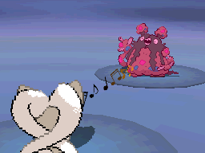 |
| 47 |  TTo | [Marill](https://bulbapedia.bulbagarden.net/wiki/Marill_(Pokémon)#Sprites)  | [present](https://bulbapedia.bulbagarden.net/wiki/Present_(move)#In_other_generations)  |
| 48 |  T9o | [Azumarill](https://bulbapedia.bulbagarden.net/wiki/Azumarill_(Pokémon)#Sprites)  | [bubble-beam](https://bulbapedia.bulbagarden.net/wiki/Bubble_Beam_(move)#In_other_generations)  |
| 49 |  T8o | [Geodude](https://bulbapedia.bulbagarden.net/wiki/Geodude_(Pokémon)#Sprites)  | [mega-punch](https://bulbapedia.bulbagarden.net/wiki/Mega_Punch_(move)#In_other_generations)  |
| 50 |  T7o | [Graveler](https://bulbapedia.bulbagarden.net/wiki/Graveler_(Pokémon)#Sprites)  | [rock-blast](https://bulbapedia.bulbagarden.net/wiki/Rock_Blast_(move)#In_other_generations)  |
| 51 |  T6o | [Golem](https://bulbapedia.bulbagarden.net/wiki/Golem_(Pokémon)#Sprites)  | [self-destruct](https://bulbapedia.bulbagarden.net/wiki/Self_Destruct_(move)#In_other_generations)  |
| 52 |  T5o | [Nosepass](https://bulbapedia.bulbagarden.net/wiki/Nosepass_(Pokémon)#Sprites)  | [block](https://bulbapedia.bulbagarden.net/wiki/Block_(move)#In_other_generations)  |
| 53 |  T4o | [Skitty](https://bulbapedia.bulbagarden.net/wiki/Skitty_(Pokémon)#Sprites)  | [heal-bell](https://bulbapedia.bulbagarden.net/wiki/Heal_Bell_(move)#In_other_generations)  |
| 54 |  T3o | [Delcatty](https://bulbapedia.bulbagarden.net/wiki/Delcatty_(Pokémon)#Sprites)  | [double-slap](https://bulbapedia.bulbagarden.net/wiki/Double_Slap_(move)#In_other_generations)  |
| 55 |  T2o | [Zubat](https://bulbapedia.bulbagarden.net/wiki/Zubat_(Pokémon)#Sprites)  | [air-cutter](https://bulbapedia.bulbagarden.net/wiki/Air_Cutter_(move)#In_other_generations)  |
| 56 |  99o | [Golbat](https://bulbapedia.bulbagarden.net/wiki/Golbat_(Pokémon)#Sprites)  | [mean-look](https://bulbapedia.bulbagarden.net/wiki/Mean_Look_(move)#In_other_generations)  |
| 57 |  98o | [Crobat](https://bulbapedia.bulbagarden.net/wiki/Crobat_(Pokémon)#Sprites)  | [haze](https://bulbapedia.bulbagarden.net/wiki/Haze_(move)#In_other_generations)  |
| 58 |  97o | [Tentacool](https://bulbapedia.bulbagarden.net/wiki/Tentacool_(Pokémon)#Sprites)  | [wrap](https://bulbapedia.bulbagarden.net/wiki/Wrap_(move)#In_other_generations)  |
| 59 |  96o | [Tentacruel](https://bulbapedia.bulbagarden.net/wiki/Tentacruel_(Pokémon)#Sprites)  | [barrier](https://bulbapedia.bulbagarden.net/wiki/Barrier_(move)#In_other_generations)  |
| 60 |  95o | [Sableye](https://bulbapedia.bulbagarden.net/wiki/Sableye_(Pokémon)#Sprites)  | [detect](https://bulbapedia.bulbagarden.net/wiki/Detect_(move)#In_other_generations)  |
| 61 |  94o | [Mawile](https://bulbapedia.bulbagarden.net/wiki/Mawile_(Pokémon)#Sprites)  | [fake-tears](https://bulbapedia.bulbagarden.net/wiki/Fake_Tears_(move)#In_other_generations)  |
| 62 |  93o | [Aron](https://bulbapedia.bulbagarden.net/wiki/Aron_(Pokémon)#Sprites)  | [metal-sound](https://bulbapedia.bulbagarden.net/wiki/Metal_Sound_(move)#In_other_generations)  |
| 63 |  92o | [Lairon](https://bulbapedia.bulbagarden.net/wiki/Lairon_(Pokémon)#Sprites)  | [iron-defense](https://bulbapedia.bulbagarden.net/wiki/Iron_Defense_(move)#In_other_generations)  |
| 64 |  88o | [Aggron](https://bulbapedia.bulbagarden.net/wiki/Aggron_(Pokémon)#Sprites)  | [mud-slap](https://bulbapedia.bulbagarden.net/wiki/Mud_Slap_(move)#In_other_generations)  |
| 65 |  87o | [Machop](https://bulbapedia.bulbagarden.net/wiki/Machop_(Pokémon)#Sprites)  | [rolling-kick](https://bulbapedia.bulbagarden.net/wiki/Rolling_Kick_(move)#In_other_generations)  |
| 66 |  86o | [Machoke](https://bulbapedia.bulbagarden.net/wiki/Machoke_(Pokémon)#Sprites)  | [karate-chop](https://bulbapedia.bulbagarden.net/wiki/Karate_Chop_(move)#In_other_generations)  |
| 67 |  85o | [Machamp](https://bulbapedia.bulbagarden.net/wiki/Machamp_(Pokémon)#Sprites)  | [low-kick](https://bulbapedia.bulbagarden.net/wiki/Low_Kick_(move)#In_other_generations)  |
| 68 |  84o | [Meditite](https://bulbapedia.bulbagarden.net/wiki/Meditite_(Pokémon)#Sprites)  | [high-jump-kick](https://bulbapedia.bulbagarden.net/wiki/High_Jump_Kick_(move)#In_other_generations)  |
| 69 |  83o | [Medicham](https://bulbapedia.bulbagarden.net/wiki/Medicham_(Pokémon)#Sprites)  | [ice-punch](https://bulbapedia.bulbagarden.net/wiki/Ice_Punch_(move)#In_other_generations)  |
| 70 |  82o | [Electrike](https://bulbapedia.bulbagarden.net/wiki/Electrike_(Pokémon)#Sprites)  | [charge](https://bulbapedia.bulbagarden.net/wiki/Charge_(move)#In_other_generations)  |
| 71 |  77o | [Manectric](https://bulbapedia.bulbagarden.net/wiki/Manectric_(Pokémon)#Sprites)  | [thunder-wave](https://bulbapedia.bulbagarden.net/wiki/Thunder_Wave_(move)#In_other_generations) 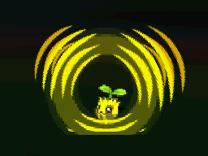 |
| 72 |  76o | [Plusle](https://bulbapedia.bulbagarden.net/wiki/Plusle_(Pokémon)#Sprites)  | [substitute](https://bulbapedia.bulbagarden.net/wiki/Substitute_(move)#In_other_generations)  |
| 73 |  75o | [Minun](https://bulbapedia.bulbagarden.net/wiki/Minun_(Pokémon)#Sprites)  | [helping-hand](https://bulbapedia.bulbagarden.net/wiki/Helping_Hand_(move)#In_other_generations)  |
| 74 |  74o | [Magnemite](https://bulbapedia.bulbagarden.net/wiki/Magnemite_(Pokémon)#Sprites)  | [thunder-shock](https://bulbapedia.bulbagarden.net/wiki/Thunder_Shock_(move)#In_other_generations) 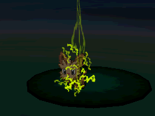 |
| 75 |  73o | [Magneton](https://bulbapedia.bulbagarden.net/wiki/Magneton_(Pokémon)#Sprites)  | [tri-attack](https://bulbapedia.bulbagarden.net/wiki/Tri_Attack_(move)#In_other_generations)  |
| 76 |  72o | [Voltorb](https://bulbapedia.bulbagarden.net/wiki/Voltorb_(Pokémon)#Sprites)  | [sonic-boom](https://bulbapedia.bulbagarden.net/wiki/Sonic_Boom_(move)#In_other_generations)  |
| 77 |  66o | [Electrode](https://bulbapedia.bulbagarden.net/wiki/Electrode_(Pokémon)#Sprites)  | [mirror-coat](https://bulbapedia.bulbagarden.net/wiki/Mirror_Coat_(move)#In_other_generations)  |
| 78 |  65o | [Volbeat](https://bulbapedia.bulbagarden.net/wiki/Volbeat_(Pokémon)#Sprites)  | [tail-glow](https://bulbapedia.bulbagarden.net/wiki/Tail_Glow_(move)#In_other_generations)  |
| 79 |  64o | [Illumise](https://bulbapedia.bulbagarden.net/wiki/Illumise_(Pokémon)#Sprites)  | [flatter](https://bulbapedia.bulbagarden.net/wiki/Flatter_(move)#In_other_generations)  |
| 80 |  63o | [Oddish](https://bulbapedia.bulbagarden.net/wiki/Oddish_(Pokémon)#Sprites)  | [sleep-powder](https://bulbapedia.bulbagarden.net/wiki/Sleep_Powder_(move)#In_other_generations)  |
| 81 |  62o | [Gloom](https://bulbapedia.bulbagarden.net/wiki/Gloom_(Pokémon)#Sprites)  | [poison-powder](https://bulbapedia.bulbagarden.net/wiki/Poison_Powder_(move)#In_other_generations)  |
| 82 |  55o | [Vileplume](https://bulbapedia.bulbagarden.net/wiki/Vileplume_(Pokémon)#Sprites)  | [aromatherapy](https://bulbapedia.bulbagarden.net/wiki/Aromatherapy_(move)#In_other_generations)  |
| 83 |  54o | [Bellossom](https://bulbapedia.bulbagarden.net/wiki/Bellossom_(Pokémon)#Sprites)  | [magical-leaf](https://bulbapedia.bulbagarden.net/wiki/Magical_Leaf_(move)#In_other_generations)  |
| 84 |  53o | [Doduo](https://bulbapedia.bulbagarden.net/wiki/Doduo_(Pokémon)#Sprites)  | [drill-peck](https://bulbapedia.bulbagarden.net/wiki/Drill_Peck_(move)#In_other_generations)  |
| 85 |  52o | [Dodrio](https://bulbapedia.bulbagarden.net/wiki/Dodrio_(Pokémon)#Sprites)  | [rage](https://bulbapedia.bulbagarden.net/wiki/Rage_(move)#In_other_generations)  |
| 86 |  44o | [Roselia](https://bulbapedia.bulbagarden.net/wiki/Roselia_(Pokémon)#Sprites)  | [grass-whistle](https://bulbapedia.bulbagarden.net/wiki/Grass_Whistle_(move)#In_other_generations)  |
| 87 |  43o | [Gulpin](https://bulbapedia.bulbagarden.net/wiki/Gulpin_(Pokémon)#Sprites)  | [pain-split](https://bulbapedia.bulbagarden.net/wiki/Pain_Split_(move)#In_other_generations)  |
| 88 |  42o | [Swalot](https://bulbapedia.bulbagarden.net/wiki/Swalot_(Pokémon)#Sprites)  | [sludge](https://bulbapedia.bulbagarden.net/wiki/Sludge_(move)#In_other_generations)  |
| 89 |  33o | [Carvanha](https://bulbapedia.bulbagarden.net/wiki/Carvanha_(Pokémon)#Sprites)  | [thrash](https://bulbapedia.bulbagarden.net/wiki/Thrash_(move)#In_other_generations)  |
| 90 |  32o | [Sharpedo](https://bulbapedia.bulbagarden.net/wiki/Sharpedo_(Pokémon)#Sprites)  | [skull-bash](https://bulbapedia.bulbagarden.net/wiki/Skull_Bash_(move)#In_other_generations)  |
| 91 |  22o | [Wailmer](https://bulbapedia.bulbagarden.net/wiki/Wailmer_(Pokémon)#Sprites)  | [water-spout](https://bulbapedia.bulbagarden.net/wiki/Water_Spout_(move)#In_other_generations)  |
| 92 |  AKs | [Wailord](https://bulbapedia.bulbagarden.net/wiki/Wailord_(Pokémon)#Sprites) 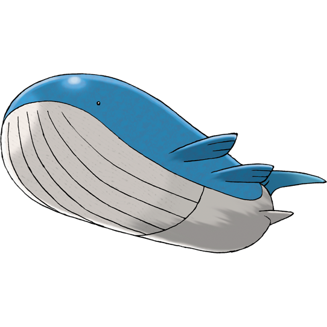 | [whirlpool](https://bulbapedia.bulbagarden.net/wiki/Whirlpool_(move)#In_other_generations) 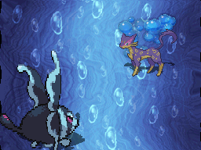 |
| 93 |  AQs | [Numel](https://bulbapedia.bulbagarden.net/wiki/Numel_(Pokémon)#Sprites) 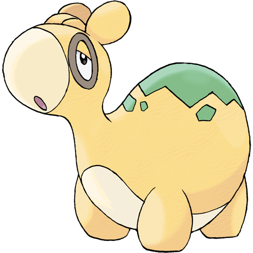 | [magnitude](https://bulbapedia.bulbagarden.net/wiki/Magnitude_(move)#In_other_generations) 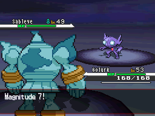 |
| 94 |  AJs | [Camerupt](https://bulbapedia.bulbagarden.net/wiki/Camerupt_(Pokémon)#Sprites) 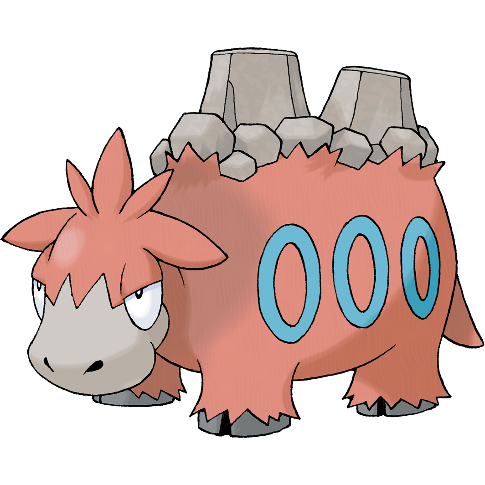 | [eruption](https://bulbapedia.bulbagarden.net/wiki/Eruption_(move)#In_other_generations) 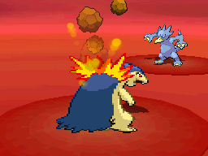 |
| 95 |  ATs | [Slugma](https://bulbapedia.bulbagarden.net/wiki/Slugma_(Pokémon)#Sprites) 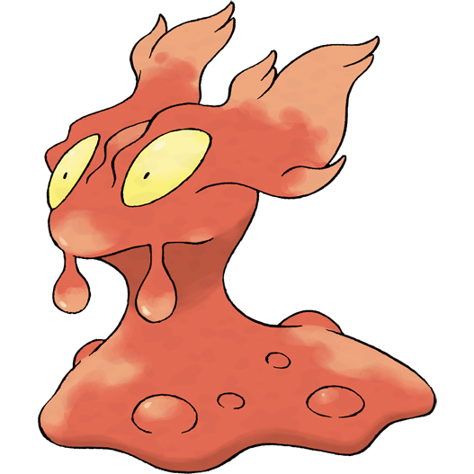 | [heat-wave](https://bulbapedia.bulbagarden.net/wiki/Heat_Wave_(move)#In_other_generations) 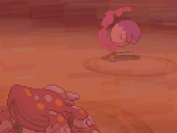 |
| 96 |  A9s | [Magcargo](https://bulbapedia.bulbagarden.net/wiki/Magcargo_(Pokémon)#Sprites) 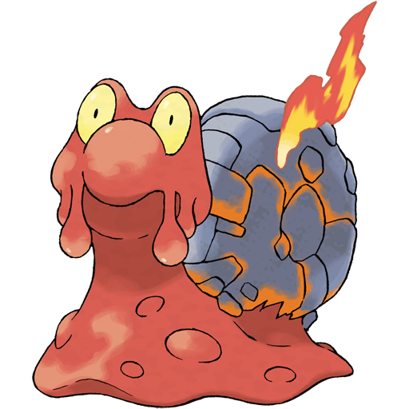 | [smog](https://bulbapedia.bulbagarden.net/wiki/Smog_(move)#In_other_generations) 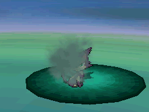 |
| 97 |  A8s | [Torkoal](https://bulbapedia.bulbagarden.net/wiki/Torkoal_(Pokémon)#Sprites) 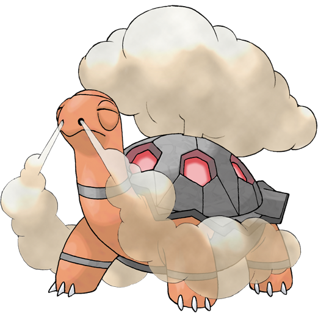 | [fire-spin](https://bulbapedia.bulbagarden.net/wiki/Fire_Spin_(move)#In_other_generations) 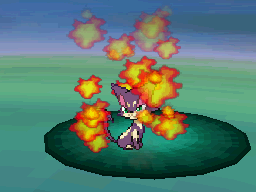 |
| 98 |  A7s | [Grimer](https://bulbapedia.bulbagarden.net/wiki/Grimer_(Pokémon)#Sprites) 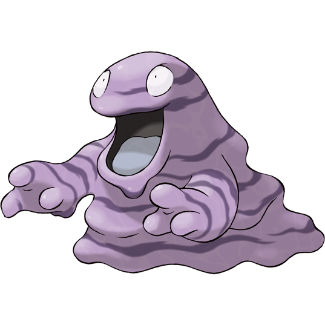 | [shadow-punch](https://bulbapedia.bulbagarden.net/wiki/Shadow_Punch_(move)#In_other_generations) 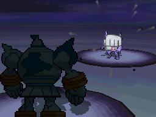 |
| 99 |  A6s | [Muk](https://bulbapedia.bulbagarden.net/wiki/Muk_(Pokémon)#Sprites) 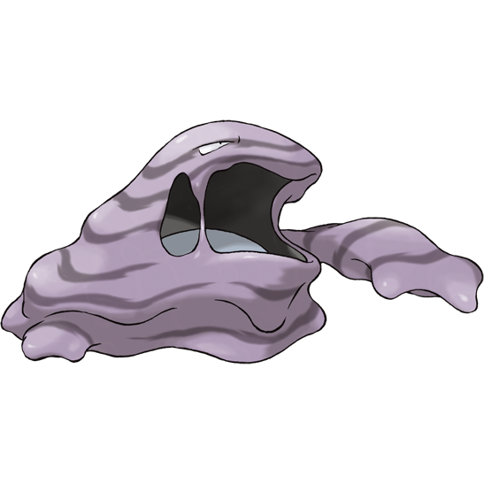 | [minimize](https://bulbapedia.bulbagarden.net/wiki/Minimize_(move)#In_other_generations) 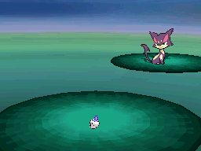 |
| 100 |  A5s | [Koffing](https://bulbapedia.bulbagarden.net/wiki/Koffing_(Pokémon)#Sprites) 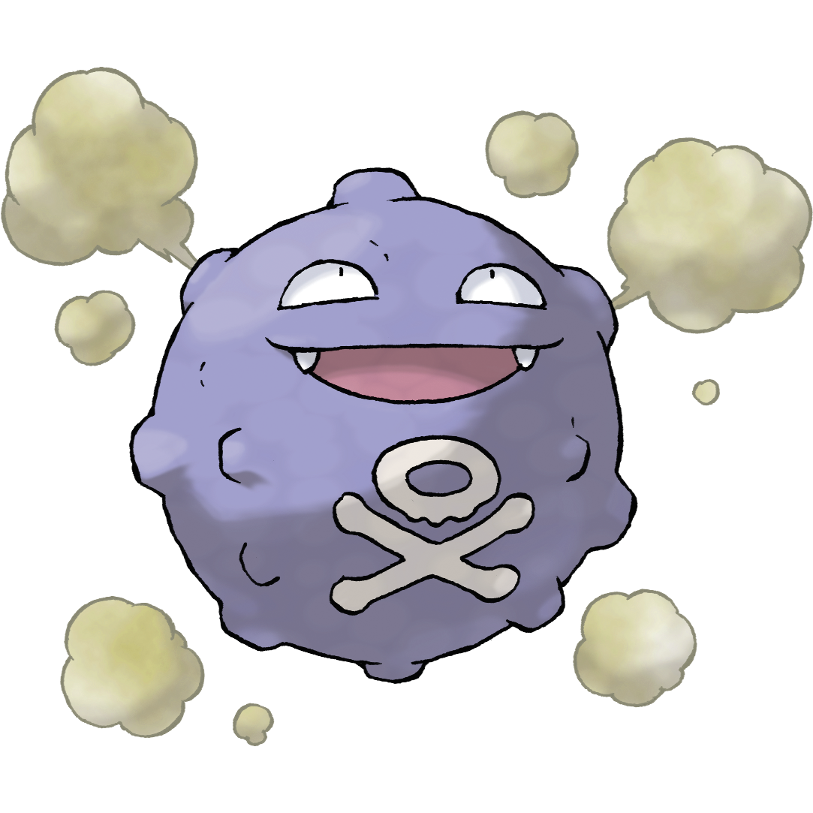 | [poison-gas](https://bulbapedia.bulbagarden.net/wiki/Poison_Gas_(move)#In_other_generations) 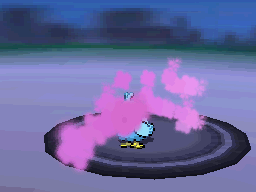 |
| 101 |  A4s | [Weezing](https://bulbapedia.bulbagarden.net/wiki/Weezing_(Pokémon)#Sprites) 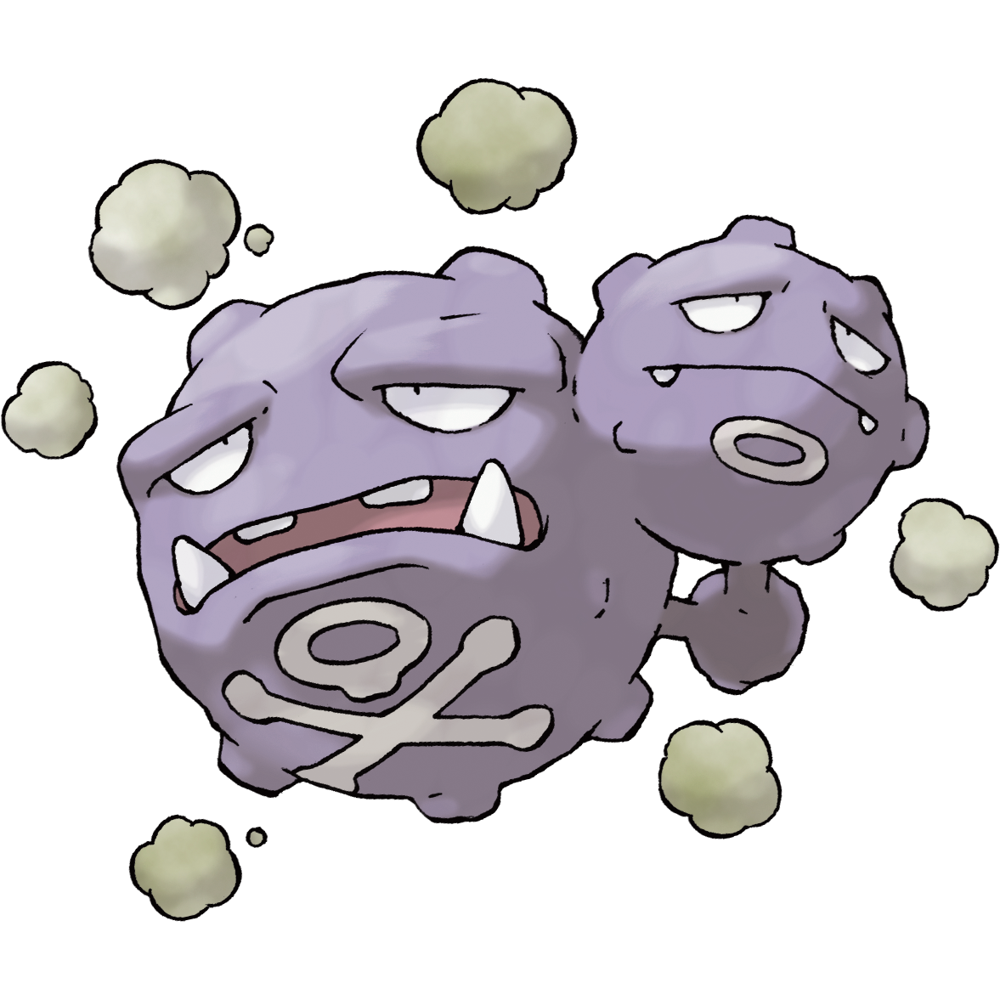 | [memento](https://bulbapedia.bulbagarden.net/wiki/Memento_(move)#In_other_generations) 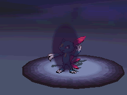 |
| 102 |  A3s | [Spoink](https://bulbapedia.bulbagarden.net/wiki/Spoink_(Pokémon)#Sprites) 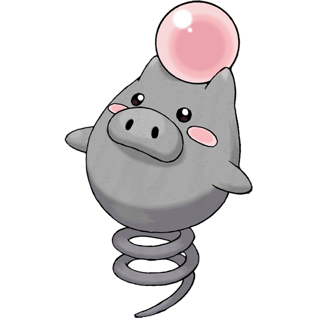 | [bounce](https://bulbapedia.bulbagarden.net/wiki/Bounce_(move)#In_other_generations) 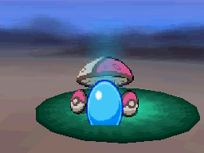 |
| 103 |  A2s | [Grumpig](https://bulbapedia.bulbagarden.net/wiki/Grumpig_(Pokémon)#Sprites) 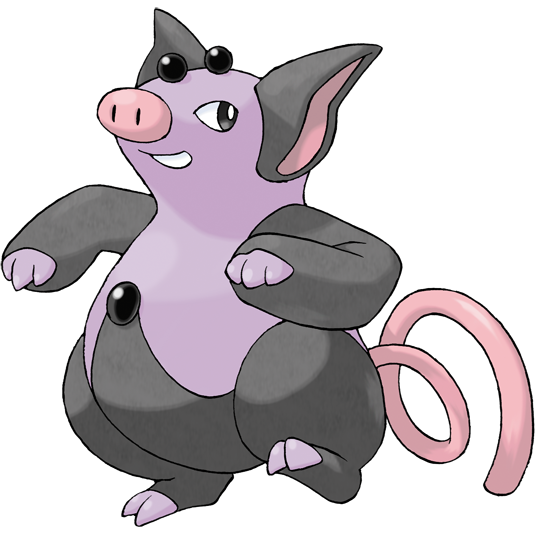 | [magic-coat](https://bulbapedia.bulbagarden.net/wiki/Magic_Coat_(move)#In_other_generations) 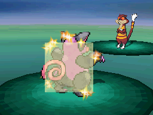 |
| 104 |  KQs | [Sandshrew](https://bulbapedia.bulbagarden.net/wiki/Sandshrew_(Pokémon)#Sprites) 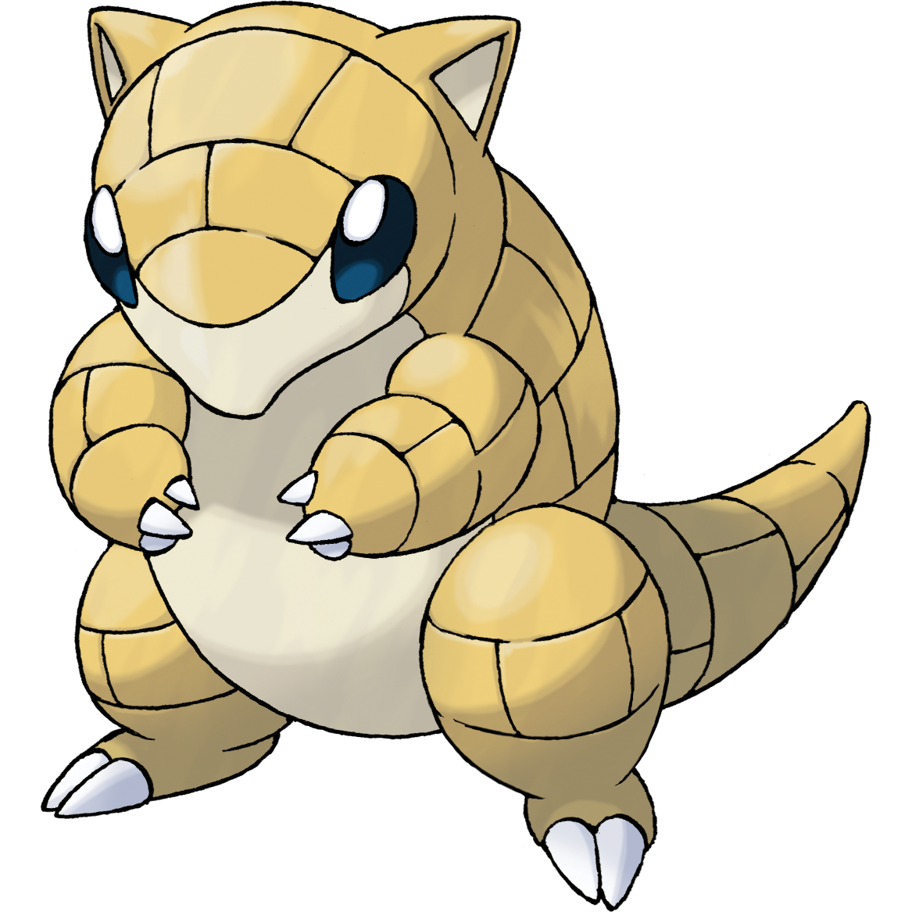 | [crush-claw](https://bulbapedia.bulbagarden.net/wiki/Crush_Claw_(move)#In_other_generations) 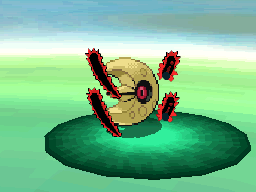 |
| 105 |  KJs | [Sandslash](https://bulbapedia.bulbagarden.net/wiki/Sandslash_(Pokémon)#Sprites)  | [sand-tomb](https://bulbapedia.bulbagarden.net/wiki/Sand_Tomb_(move)#In_other_generations) 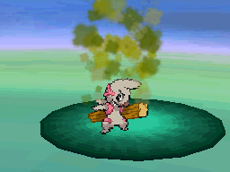 |
| 106 |  KTs | [Spinda](https://bulbapedia.bulbagarden.net/wiki/Spinda_(Pokémon)#Sprites) 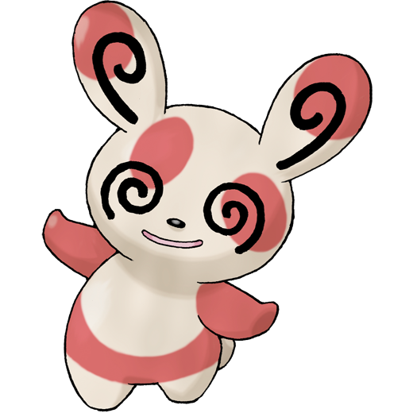 | [dizzy-punch](https://bulbapedia.bulbagarden.net/wiki/Dizzy_Punch_(move)#In_other_generations) 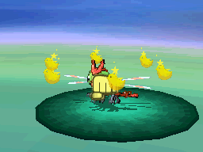 |
| 107 |  K9s | [Skarmory](https://bulbapedia.bulbagarden.net/wiki/Skarmory_(Pokémon)#Sprites) 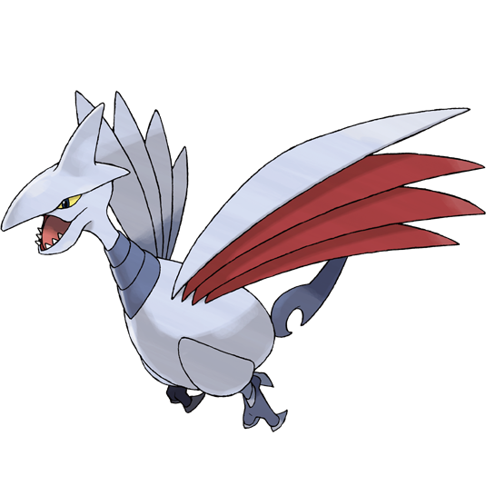 | [spikes](https://bulbapedia.bulbagarden.net/wiki/Spikes_(move)#In_other_generations) 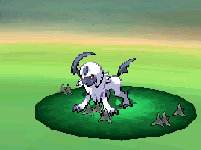 |
| 108 |  K8s | [Trapinch](https://bulbapedia.bulbagarden.net/wiki/Trapinch_(Pokémon)#Sprites) 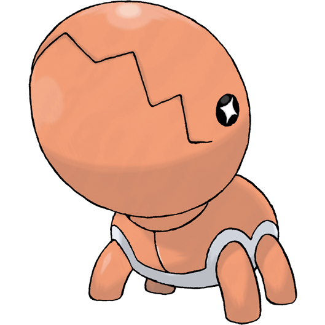 | [crunch](https://bulbapedia.bulbagarden.net/wiki/Crunch_(move)#In_other_generations) 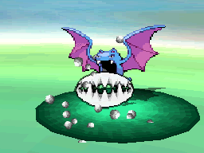 |
| 109 |  K7s | [Vibrava](https://bulbapedia.bulbagarden.net/wiki/Vibrava_(Pokémon)#Sprites) 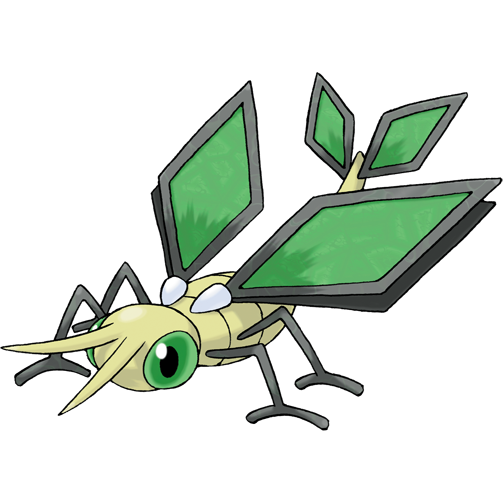 | [dragon-breath](https://bulbapedia.bulbagarden.net/wiki/Dragon_Breath_(move)#In_other_generations) 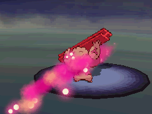 |
| 110 |  K6s | [Flygon](https://bulbapedia.bulbagarden.net/wiki/Flygon_(Pokémon)#Sprites) 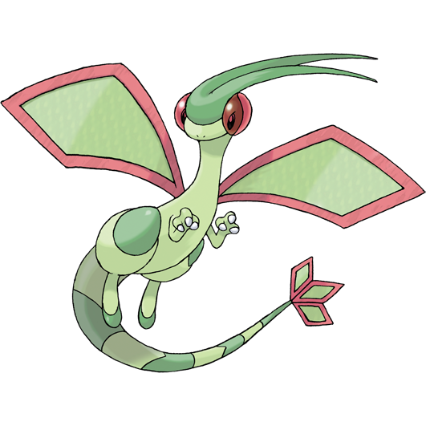 | [dragon-claw](https://bulbapedia.bulbagarden.net/wiki/Dragon_Claw_(move)#In_other_generations) 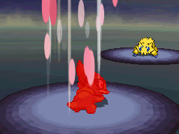 |
| 111 |  K5s | [Cacnea](https://bulbapedia.bulbagarden.net/wiki/Cacnea_(Pokémon)#Sprites) 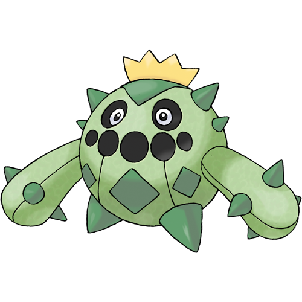 | [teeter-dance](https://bulbapedia.bulbagarden.net/wiki/Teeter_Dance_(move)#In_other_generations) 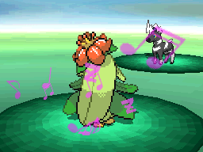 |
| 112 |  K4s | [Cacturne](https://bulbapedia.bulbagarden.net/wiki/Cacturne_(Pokémon)#Sprites) 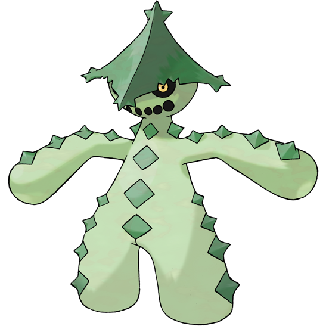 | [needle-arm](https://bulbapedia.bulbagarden.net/wiki/Needle_Arm_(move)#In_other_generations) 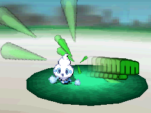 |
| 113 |  K3s | [Swablu](https://bulbapedia.bulbagarden.net/wiki/Swablu_(Pokémon)#Sprites) 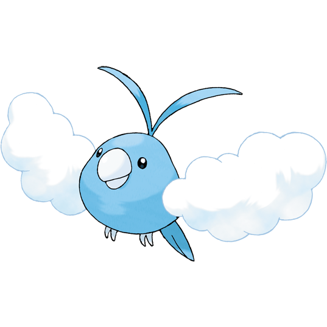 | [perish-song](https://bulbapedia.bulbagarden.net/wiki/Perish_Song_(move)#In_other_generations) 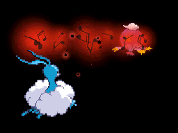 |
| 114 |  K2s | [Altaria](https://bulbapedia.bulbagarden.net/wiki/Altaria_(Pokémon)#Sprites) 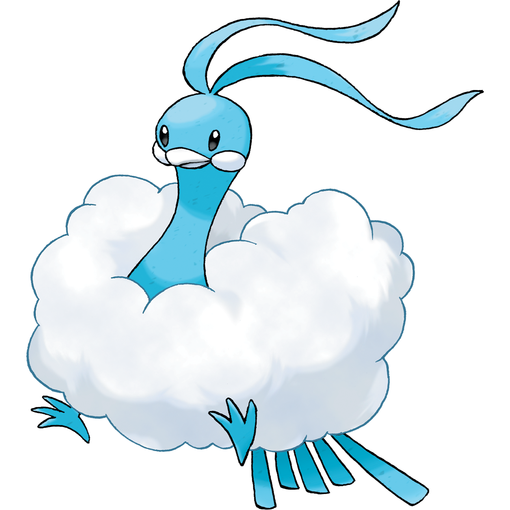 | [dragon-dance](https://bulbapedia.bulbagarden.net/wiki/Dragon_Dance_(move)#In_other_generations) 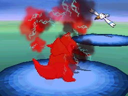 |
| 115 |  QJs | [Zangoose](https://bulbapedia.bulbagarden.net/wiki/Zangoose_(Pokémon)#Sprites) 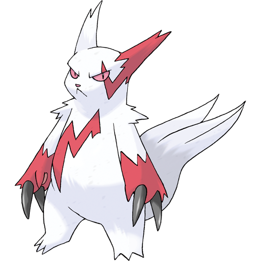 | [double-kick](https://bulbapedia.bulbagarden.net/wiki/Double_Kick_(move)#In_other_generations) 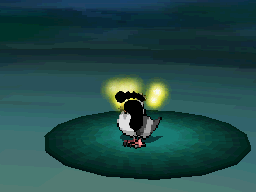 |
| 116 |  QTs | [Seviper](https://bulbapedia.bulbagarden.net/wiki/Seviper_(Pokémon)#Sprites) 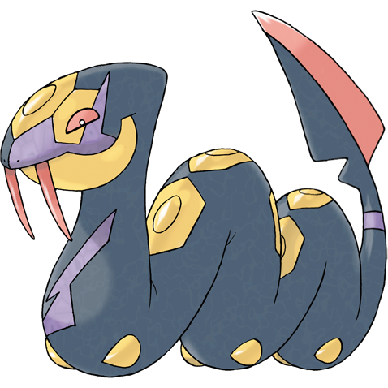 | [glare](https://bulbapedia.bulbagarden.net/wiki/Glare_(move)#In_other_generations) 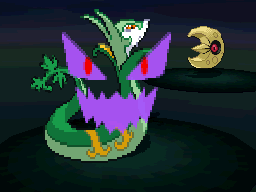 |
| 117 |  Q9s | [Lunatone](https://bulbapedia.bulbagarden.net/wiki/Lunatone_(Pokémon)#Sprites) 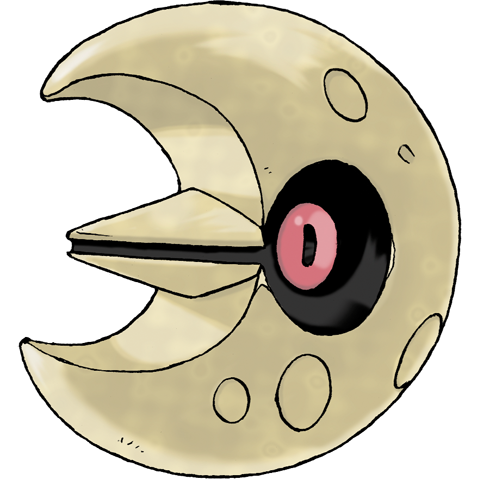 | [cosmic-power](https://bulbapedia.bulbagarden.net/wiki/Cosmic_Power_(move)#In_other_generations) 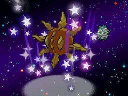 |
| 118 |  Q8s | [Solrock](https://bulbapedia.bulbagarden.net/wiki/Solrock_(Pokémon)#Sprites) 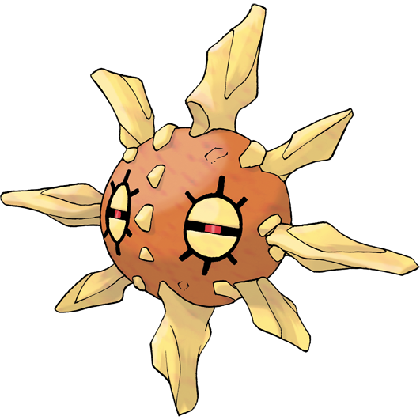 | [psywave](https://bulbapedia.bulbagarden.net/wiki/Psywave_(move)#In_other_generations) 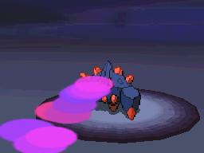 |
| 119 |  Q7s | [Barboach](https://bulbapedia.bulbagarden.net/wiki/Barboach_(Pokémon)#Sprites) 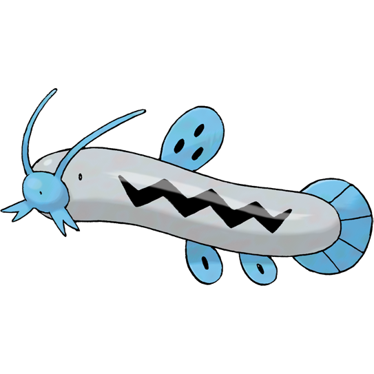 | [fissure](https://bulbapedia.bulbagarden.net/wiki/Fissure_(move)#In_other_generations) 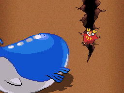 |
| 120 |  Q6s | [Whiscash](https://bulbapedia.bulbagarden.net/wiki/Whiscash_(Pokémon)#Sprites) 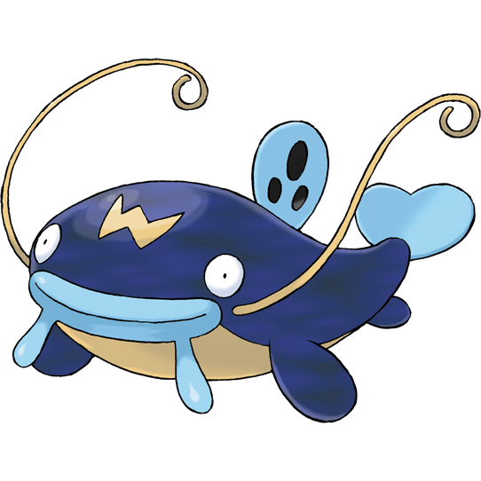 | [tickle](https://bulbapedia.bulbagarden.net/wiki/Tickle_(move)#In_other_generations)  |
| 121 |  Q5s | [Corphish](https://bulbapedia.bulbagarden.net/wiki/Corphish_(Pokémon)#Sprites) 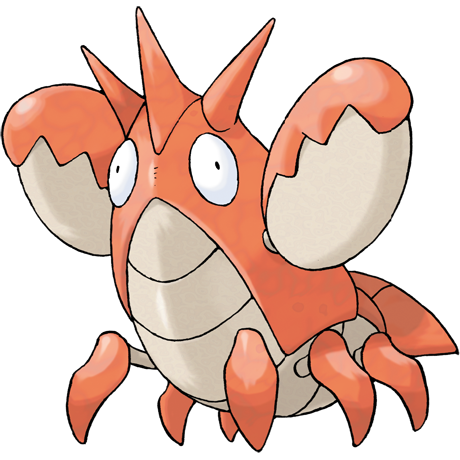 | [crabhammer](https://bulbapedia.bulbagarden.net/wiki/Crabhammer_(move)#In_other_generations) 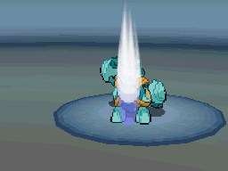 |
| 122 |  Q4s | [Crawdaunt](https://bulbapedia.bulbagarden.net/wiki/Crawdaunt_(Pokémon)#Sprites) 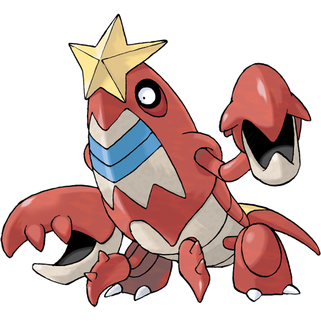 | [guillotine](https://bulbapedia.bulbagarden.net/wiki/Guillotine_(move)#In_other_generations) 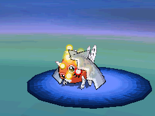 |
| 123 |  Q3s | [Baltoy](https://bulbapedia.bulbagarden.net/wiki/Baltoy_(Pokémon)#Sprites) 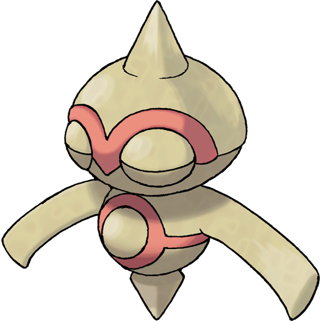 | [rapid-spin](https://bulbapedia.bulbagarden.net/wiki/Rapid_Spin_(move)#In_other_generations) 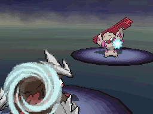 |
| 124 |  Q2s | [Claydol](https://bulbapedia.bulbagarden.net/wiki/Claydol_(Pokémon)#Sprites) 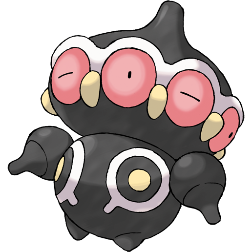 | [teleport](https://bulbapedia.bulbagarden.net/wiki/Teleport_(move)#In_other_generations) 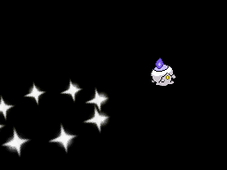 |
| 125 |  JTs | [Lileep](https://bulbapedia.bulbagarden.net/wiki/Lileep_(Pokémon)#Sprites) 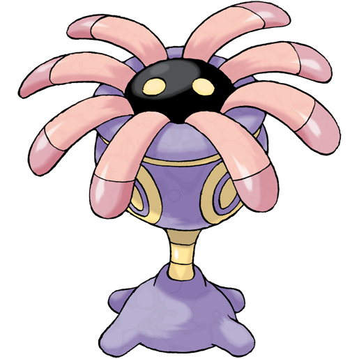 | [constrict](https://bulbapedia.bulbagarden.net/wiki/Constrict_(move)#In_other_generations) 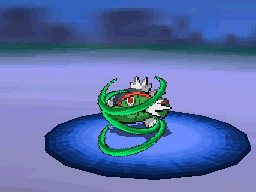 |
| 126 |  J9s | [Cradily](https://bulbapedia.bulbagarden.net/wiki/Cradily_(Pokémon)#Sprites) 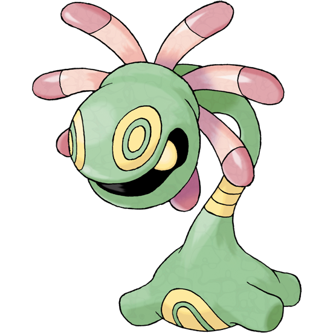 | [acid](https://bulbapedia.bulbagarden.net/wiki/Acid_(move)#In_other_generations) 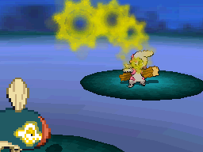 |
| 127 |  J8s | [Anorith](https://bulbapedia.bulbagarden.net/wiki/Anorith_(Pokémon)#Sprites) 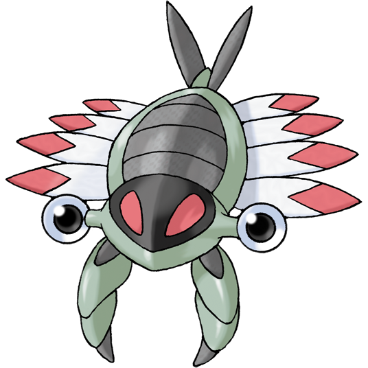 | [knock-off](https://bulbapedia.bulbagarden.net/wiki/Knock_Off_(move)#In_other_generations) 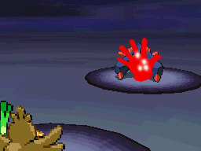 |
| 128 |  J7s | [Armaldo](https://bulbapedia.bulbagarden.net/wiki/Armaldo_(Pokémon)#Sprites) 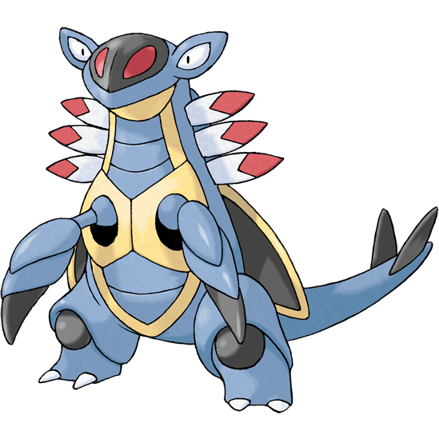 | [metal-claw](https://bulbapedia.bulbagarden.net/wiki/Metal_Claw_(move)#In_other_generations)  |
| 129 |  J6s | [Feebas](https://bulbapedia.bulbagarden.net/wiki/Feebas_(Pokémon)#Sprites) 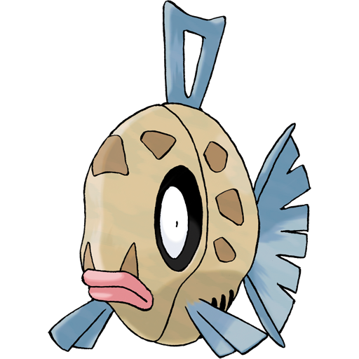 | [mud-sport](https://bulbapedia.bulbagarden.net/wiki/Mud_Sport_(move)#In_other_generations) 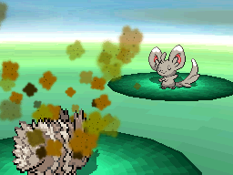 |
| 130 |  J5s | [Milotic](https://bulbapedia.bulbagarden.net/wiki/Milotic_(Pokémon)#Sprites) 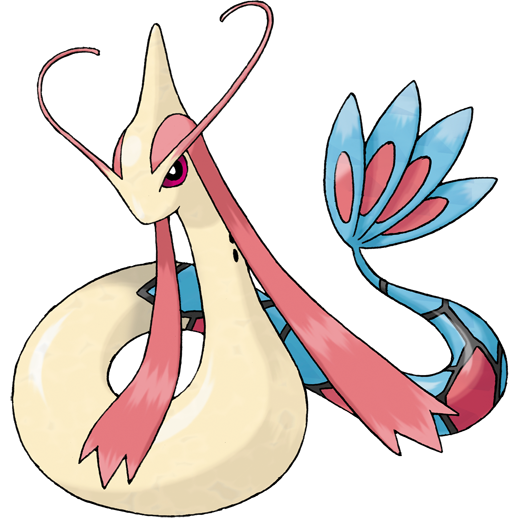 | [twister](https://bulbapedia.bulbagarden.net/wiki/Twister_(move)#In_other_generations) 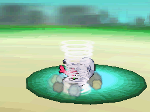 |
| 131 |  J4s | [Castform](https://bulbapedia.bulbagarden.net/wiki/Castform_(Pokémon)#Sprites)  | [weather-ball](https://bulbapedia.bulbagarden.net/wiki/Weather_Ball_(move)#In_other_generations)  |
| 132 |  J3s | [Staryu](https://bulbapedia.bulbagarden.net/wiki/Staryu_(Pokémon)#Sprites) 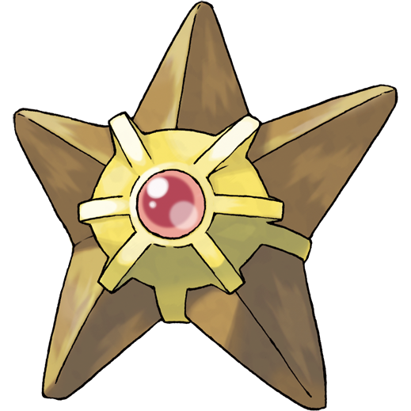 | [camouflage](https://bulbapedia.bulbagarden.net/wiki/Camouflage_(move)#In_other_generations) 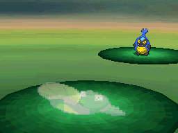 |
| 133 |  J2s | [Starmie](https://bulbapedia.bulbagarden.net/wiki/Starmie_(Pokémon)#Sprites) 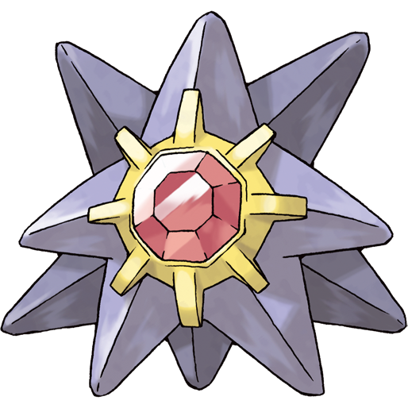 | [swift](https://bulbapedia.bulbagarden.net/wiki/Swift_(move)#In_other_generations)  |
| 134 |  T9s | [Kecleon](https://bulbapedia.bulbagarden.net/wiki/Kecleon_(Pokémon)#Sprites) 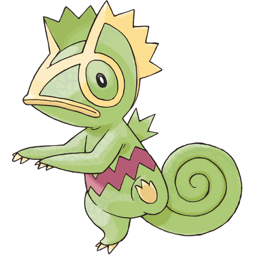 | [bind](https://bulbapedia.bulbagarden.net/wiki/Bind_(move)#In_other_generations) 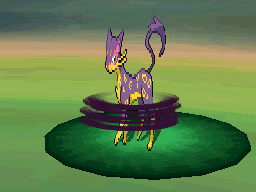 |
| 135 |  T8s | [Shuppet](https://bulbapedia.bulbagarden.net/wiki/Shuppet_(Pokémon)#Sprites)  | [grudge](https://bulbapedia.bulbagarden.net/wiki/Grudge_(move)#In_other_generations) 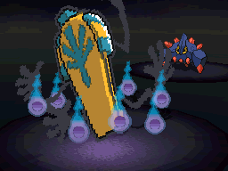 |
| 136 |  T7s | [Banette](https://bulbapedia.bulbagarden.net/wiki/Banette_(Pokémon)#Sprites) 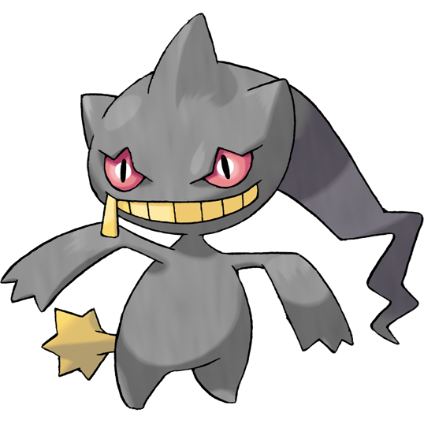 | [will-o-wisp](https://bulbapedia.bulbagarden.net/wiki/Will_O_Wisp_(move)#In_other_generations) 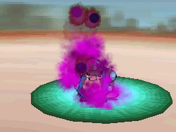 |
| 137 |  T6s | [Duskull](https://bulbapedia.bulbagarden.net/wiki/Duskull_(Pokémon)#Sprites) 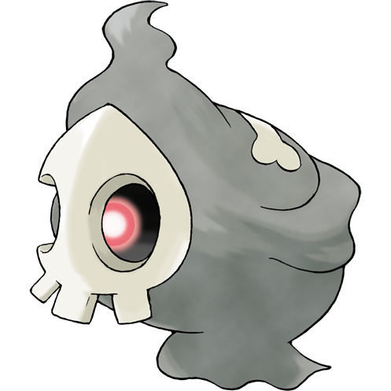 | [night-shade](https://bulbapedia.bulbagarden.net/wiki/Night_Shade_(move)#In_other_generations) 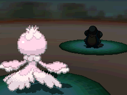 |
| 138 |  T5s | [Dusclops](https://bulbapedia.bulbagarden.net/wiki/Dusclops_(Pokémon)#Sprites) 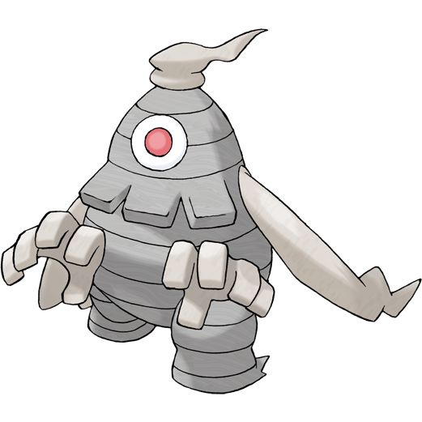 | [foresight](https://bulbapedia.bulbagarden.net/wiki/Foresight_(move)#In_other_generations) 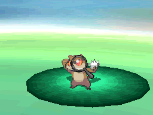 |
| 139 |  T4s | [Tropius](https://bulbapedia.bulbagarden.net/wiki/Tropius_(Pokémon)#Sprites) 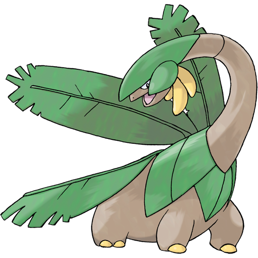 | [synthesis](https://bulbapedia.bulbagarden.net/wiki/Synthesis_(move)#In_other_generations) 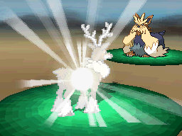 |
| 140 |  T3s | [Chimecho](https://bulbapedia.bulbagarden.net/wiki/Chimecho_(Pokémon)#Sprites) 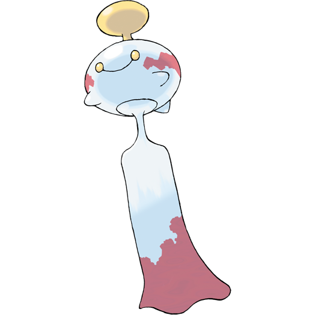 | [yawn](https://bulbapedia.bulbagarden.net/wiki/Yawn_(move)#In_other_generations) 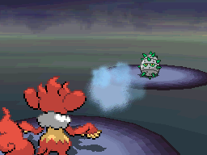 |
| 141 |  T2s | [Absol](https://bulbapedia.bulbagarden.net/wiki/Absol_(Pokémon)#Sprites) 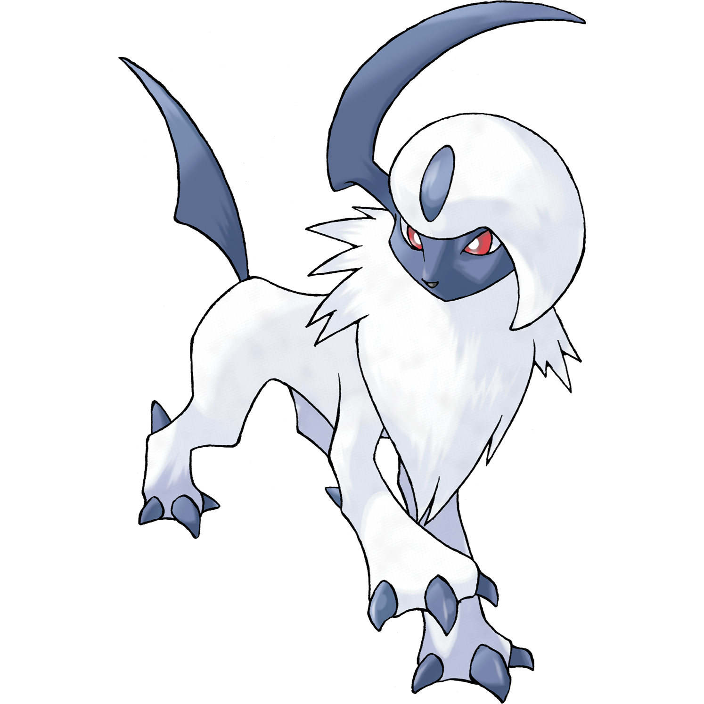 | [swords-dance](https://bulbapedia.bulbagarden.net/wiki/Swords_Dance_(move)#In_other_generations) 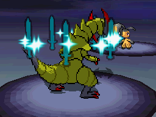 |
| 142 |  98s | [Vulpix](https://bulbapedia.bulbagarden.net/wiki/Vulpix_(Pokémon)#Sprites) 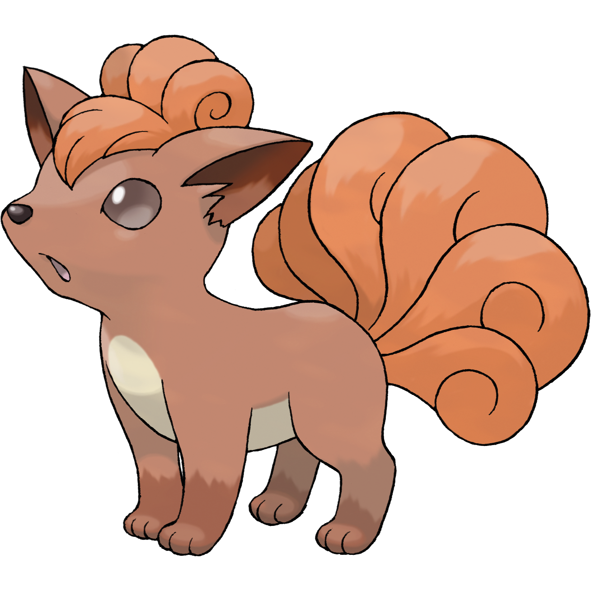 | [overheat](https://bulbapedia.bulbagarden.net/wiki/Overheat_(move)#In_other_generations) 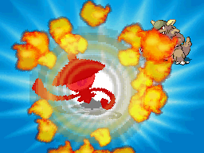 |
| 143 |  97s | [Ninetales](https://bulbapedia.bulbagarden.net/wiki/Ninetales_(Pokémon)#Sprites) 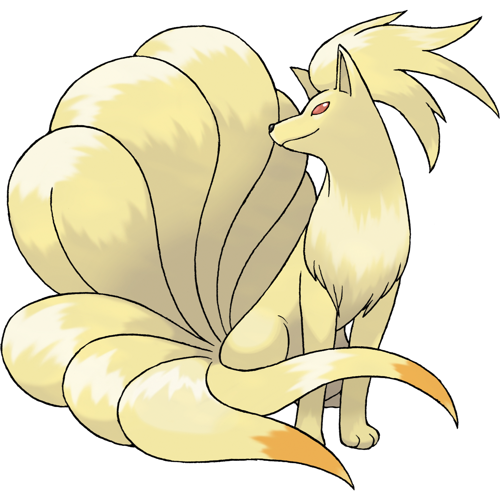 | [ember](https://bulbapedia.bulbagarden.net/wiki/Ember_(move)#In_other_generations) 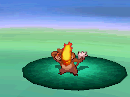 |
| 144 |  96s | [Pichu](https://bulbapedia.bulbagarden.net/wiki/Pichu_(Pokémon)#Sprites)  | [sweet-kiss](https://bulbapedia.bulbagarden.net/wiki/Sweet_Kiss_(move)#In_other_generations) 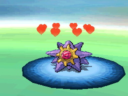 |
| 145 |  95s | [Psyduck](https://bulbapedia.bulbagarden.net/wiki/Psyduck_(Pokémon)#Sprites)  | [cross-chop](https://bulbapedia.bulbagarden.net/wiki/Cross_Chop_(move)#In_other_generations) 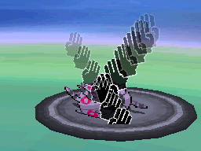 |
| 146 |  94s | [Golduck](https://bulbapedia.bulbagarden.net/wiki/Golduck_(Pokémon)#Sprites) 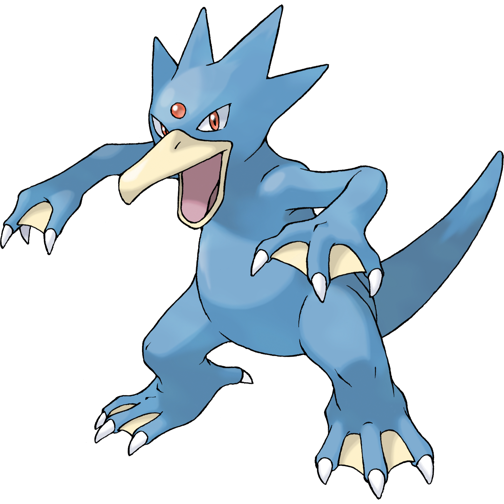 | [fury-swipes](https://bulbapedia.bulbagarden.net/wiki/Fury_Swipes_(move)#In_other_generations) 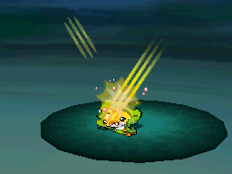 |
| 147 |  93s | [Wynaut](https://bulbapedia.bulbagarden.net/wiki/Wynaut_(Pokémon)#Sprites)  | [destiny-bond](https://bulbapedia.bulbagarden.net/wiki/Destiny_Bond_(move)#In_other_generations) 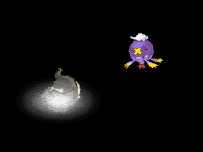 |
| 148 |  92s | [Wobbuffet](https://bulbapedia.bulbagarden.net/wiki/Wobbuffet_(Pokémon)#Sprites) 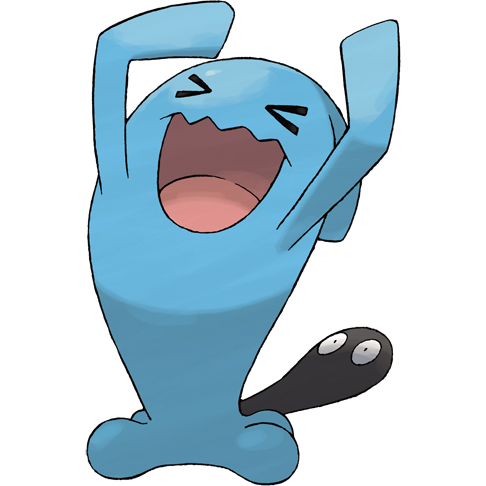 | [counter](https://bulbapedia.bulbagarden.net/wiki/Counter_(move)#In_other_generations) 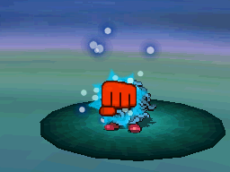 |
| 149 |  87s | [Natu](https://bulbapedia.bulbagarden.net/wiki/Natu_(Pokémon)#Sprites) 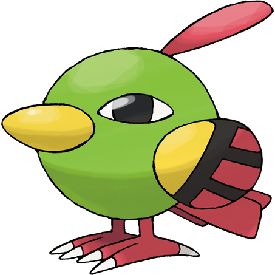 | [feather-dance](https://bulbapedia.bulbagarden.net/wiki/Feather_Dance_(move)#In_other_generations) 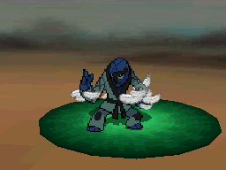 |
| 150 |  86s | [Xatu](https://bulbapedia.bulbagarden.net/wiki/Xatu_(Pokémon)#Sprites) 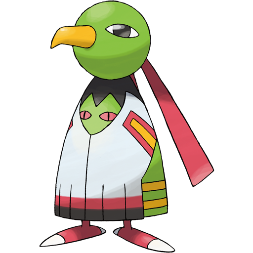 | [wish](https://bulbapedia.bulbagarden.net/wiki/Wish_(move)#In_other_generations)  |
| 151 |  85s | [Girafarig](https://bulbapedia.bulbagarden.net/wiki/Girafarig_(Pokémon)#Sprites) 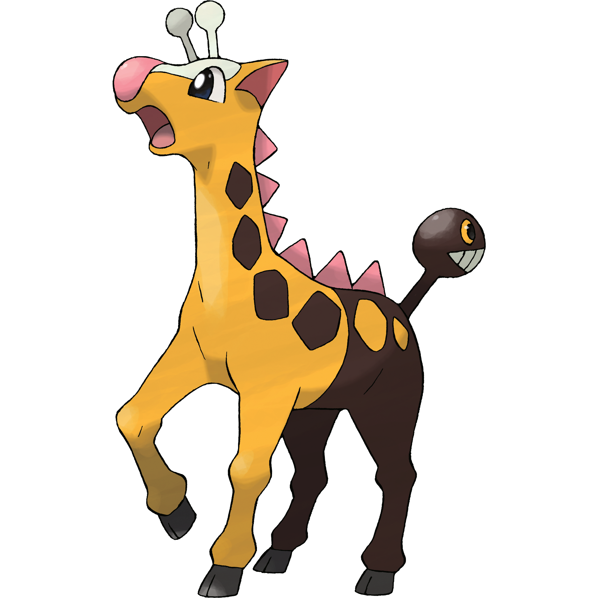 | [beat-up](https://bulbapedia.bulbagarden.net/wiki/Beat_Up_(move)#In_other_generations) 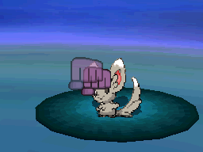 |
| 152 |  84s | [Phanpy](https://bulbapedia.bulbagarden.net/wiki/Phanpy_(Pokémon)#Sprites) 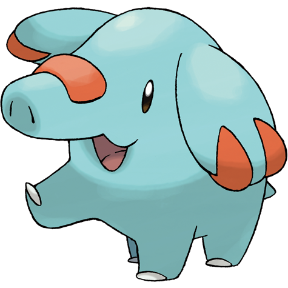 | [snore](https://bulbapedia.bulbagarden.net/wiki/Snore_(move)#In_other_generations) 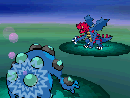 |
| 153 |  83s | [Donphan](https://bulbapedia.bulbagarden.net/wiki/Donphan_(Pokémon)#Sprites) 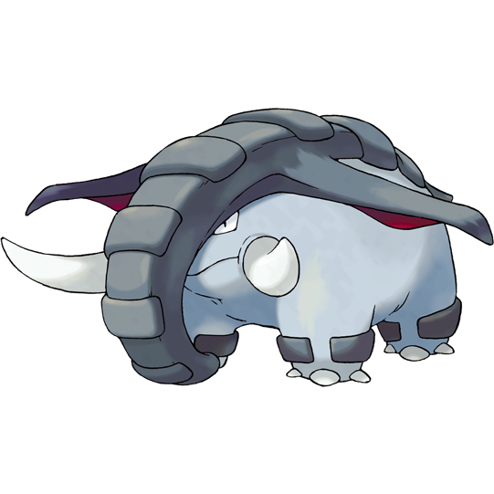 | [defense-curl](https://bulbapedia.bulbagarden.net/wiki/Defense_Curl_(move)#In_other_generations) 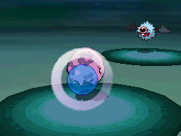 |
| 154 |  82s | [Pinsir](https://bulbapedia.bulbagarden.net/wiki/Pinsir_(Pokémon)#Sprites) 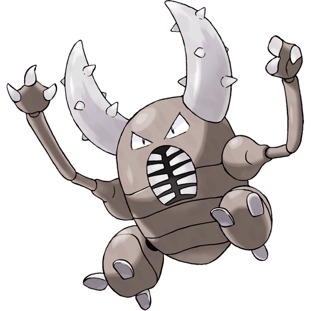 | [submission](https://bulbapedia.bulbagarden.net/wiki/Submission_(move)#In_other_generations) 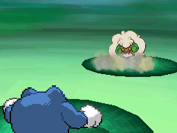 |
| 155 |  76s | [Heracross](https://bulbapedia.bulbagarden.net/wiki/Heracross_(Pokémon)#Sprites) 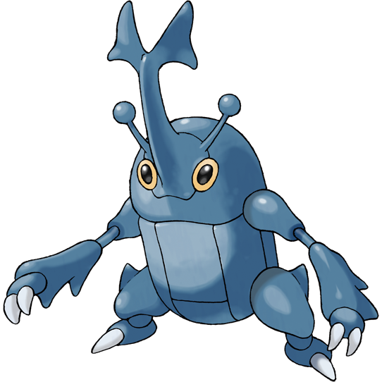 | [megahorn](https://bulbapedia.bulbagarden.net/wiki/Megahorn_(move)#In_other_generations) 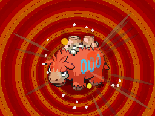 |
| 156 |  75s | [Rhyhorn](https://bulbapedia.bulbagarden.net/wiki/Rhyhorn_(Pokémon)#Sprites) 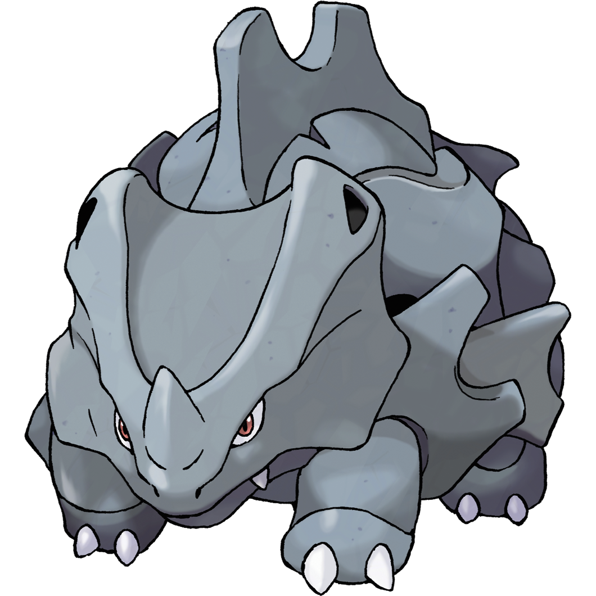 | [reversal](https://bulbapedia.bulbagarden.net/wiki/Reversal_(move)#In_other_generations) 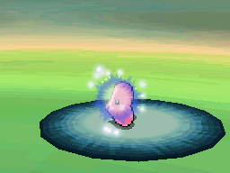 |
| 157 |  74s | [Rhydon](https://bulbapedia.bulbagarden.net/wiki/Rhydon_(Pokémon)#Sprites) 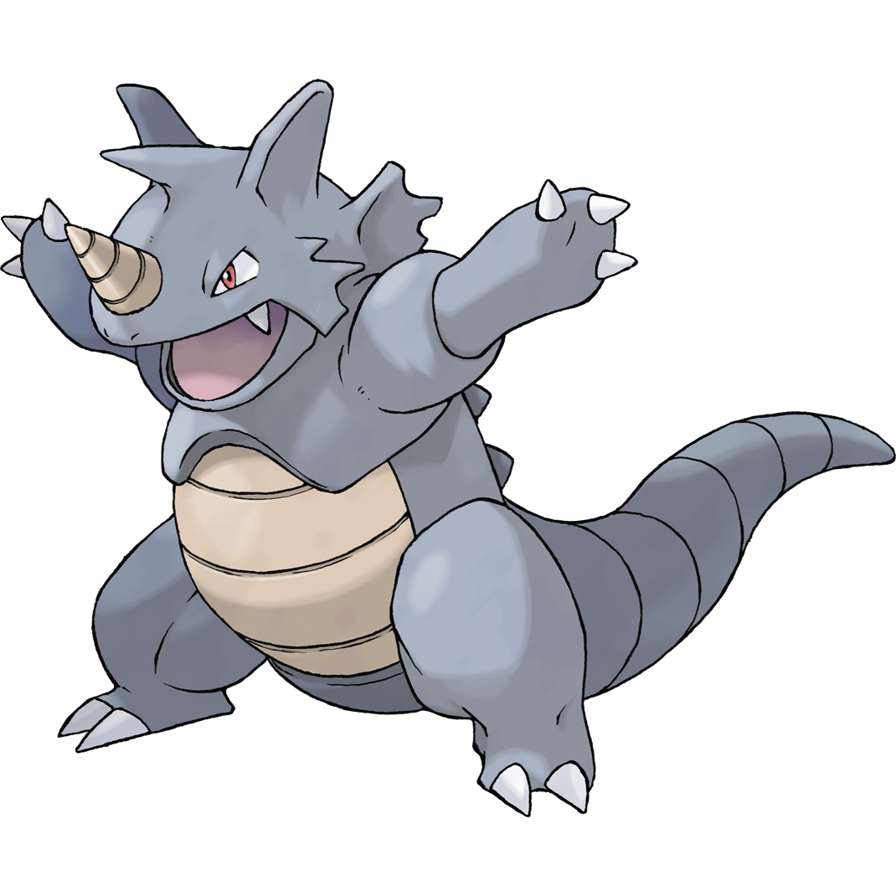 | [fury-attack](https://bulbapedia.bulbagarden.net/wiki/Fury_Attack_(move)#In_other_generations) 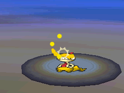 |
| 158 |  73s | [Snorunt](https://bulbapedia.bulbagarden.net/wiki/Snorunt_(Pokémon)#Sprites) 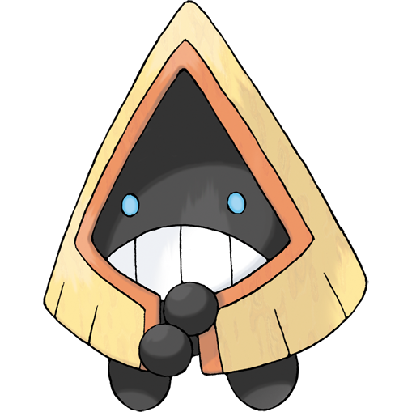 | [icy-wind](https://bulbapedia.bulbagarden.net/wiki/Icy_Wind_(move)#In_other_generations) 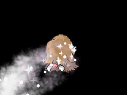 |
| 159 |  72s | [Glalie](https://bulbapedia.bulbagarden.net/wiki/Glalie_(Pokémon)#Sprites) 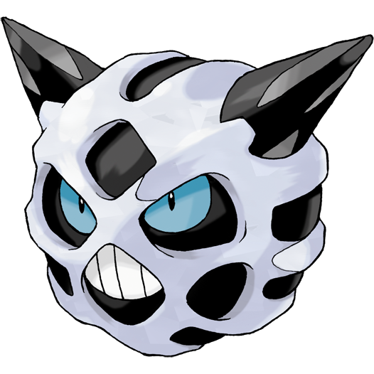 | [sheer-cold](https://bulbapedia.bulbagarden.net/wiki/Sheer_Cold_(move)#In_other_generations) 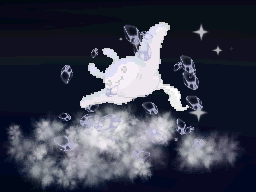 |
| 160 |  65s | [Spheal](https://bulbapedia.bulbagarden.net/wiki/Spheal_(Pokémon)#Sprites) 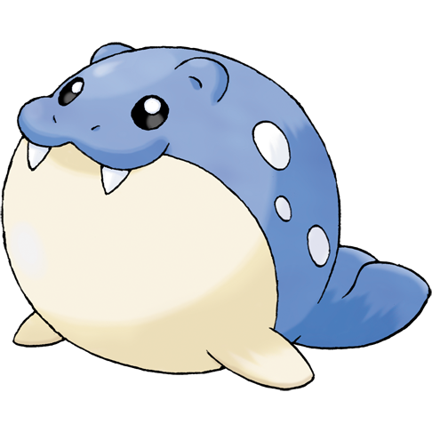 | [aurora-beam](https://bulbapedia.bulbagarden.net/wiki/Aurora_Beam_(move)#In_other_generations) 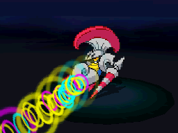 |
| 161 |  64s | [Sealeo](https://bulbapedia.bulbagarden.net/wiki/Sealeo_(Pokémon)#Sprites) 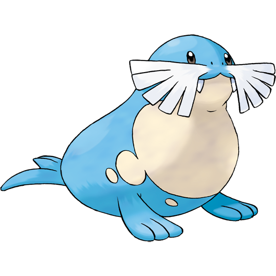 | [powder-snow](https://bulbapedia.bulbagarden.net/wiki/Powder_Snow_(move)#In_other_generations) 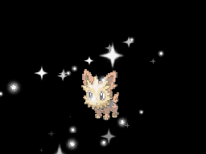 |
| 162 |  63s | [Walrein](https://bulbapedia.bulbagarden.net/wiki/Walrein_(Pokémon)#Sprites) 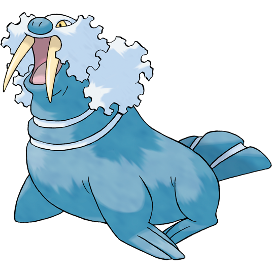 | [body-slam](https://bulbapedia.bulbagarden.net/wiki/Body_Slam_(move)#In_other_generations) 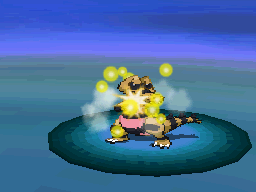 |
| 163 |  62s | [Clamperl](https://bulbapedia.bulbagarden.net/wiki/Clamperl_(Pokémon)#Sprites) 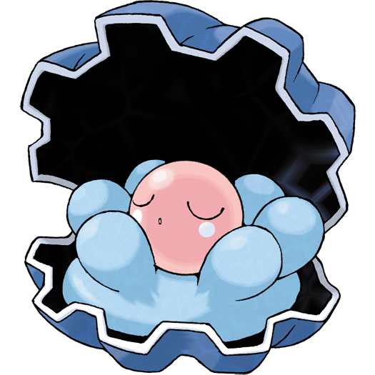 | [clamp](https://bulbapedia.bulbagarden.net/wiki/Clamp_(move)#In_other_generations) 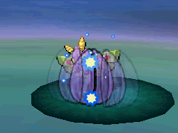 |
| 164 |  54s | [Huntail](https://bulbapedia.bulbagarden.net/wiki/Huntail_(Pokémon)#Sprites) 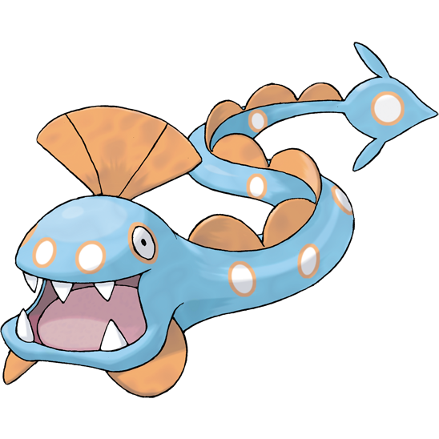 | [baton-pass](https://bulbapedia.bulbagarden.net/wiki/Baton_Pass_(move)#In_other_generations) 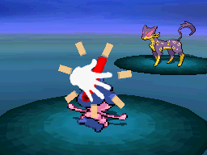 |
| 165 |  53s | [Gorebyss](https://bulbapedia.bulbagarden.net/wiki/Gorebyss_(Pokémon)#Sprites) 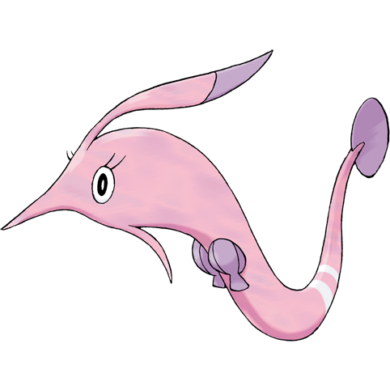 | [amnesia](https://bulbapedia.bulbagarden.net/wiki/Amnesia_(move)#In_other_generations) 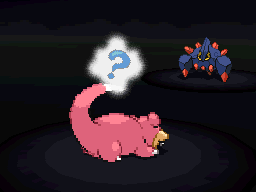 |
| 166 |  52s | [Corsola](https://bulbapedia.bulbagarden.net/wiki/Corsola_(Pokémon)#Sprites) 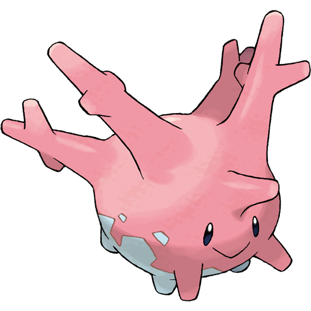 | [spike-cannon](https://bulbapedia.bulbagarden.net/wiki/Spike_Cannon_(move)#In_other_generations) 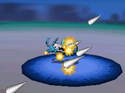 |
| 167 |  43s | [Chinchou](https://bulbapedia.bulbagarden.net/wiki/Chinchou_(Pokémon)#Sprites) 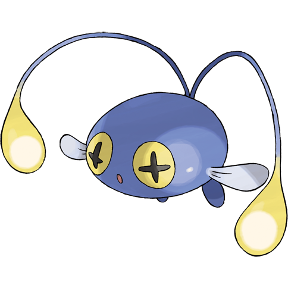 | [bubble](https://bulbapedia.bulbagarden.net/wiki/Bubble_(move)#In_other_generations) 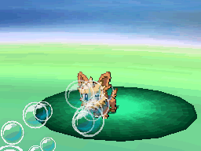 |
| 168 |  42s | [Lanturn](https://bulbapedia.bulbagarden.net/wiki/Lanturn_(Pokémon)#Sprites) 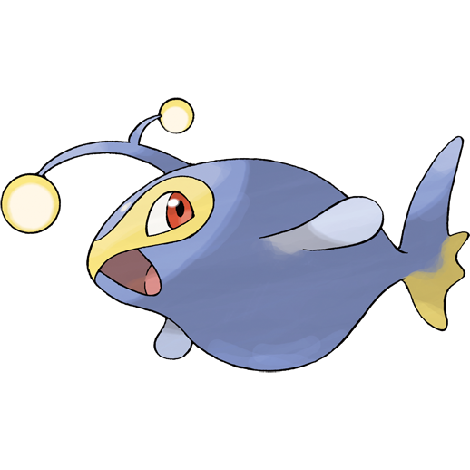 | [spark](https://bulbapedia.bulbagarden.net/wiki/Spark_(move)#In_other_generations)  |
| 169 |  32s | [Luvdisc](https://bulbapedia.bulbagarden.net/wiki/Luvdisc_(Pokémon)#Sprites) 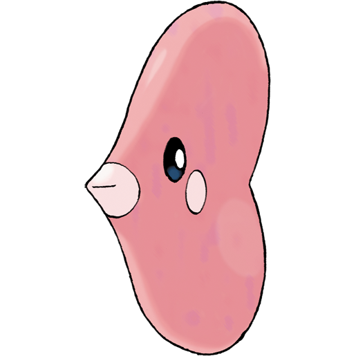 | [charm](https://bulbapedia.bulbagarden.net/wiki/Charm_(move)#In_other_generations) 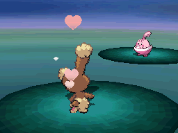 |
