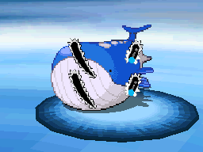
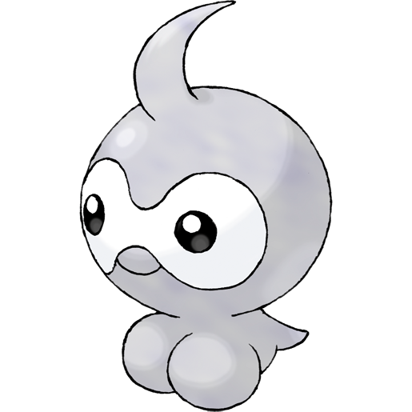
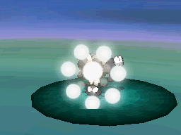
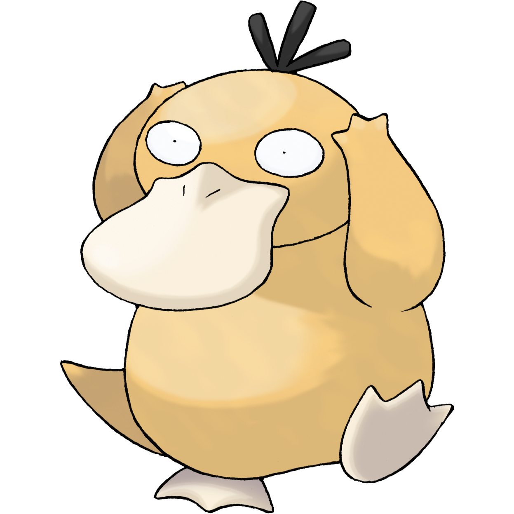
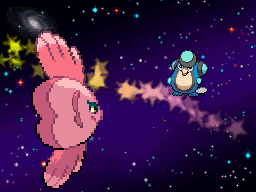

| **Rank** | **Hand** | **Pokemon** | **Move** |
|----------|-------------|----------|----------|
| 1 |  AAo | [Treecko](https://bulbapedia.bulbagarden.net/wiki/Treecko)  | [slam](https://bulbapedia.bulbagarden.net/wiki/File:Slam_B2W2.png)  |
| 2 |  AKo | [Torchic](https://bulbapedia.bulbagarden.net/wiki/Torchic)  | [mirror-move](https://bulbapedia.bulbagarden.net/wiki/File:Mirror_Move_B2W2.png)  |
| 3 |  AQo | [Mudkip](https://bulbapedia.bulbagarden.net/wiki/Mudkip)  | [ice-ball](https://bulbapedia.bulbagarden.net/wiki/File:Ice_Ball_B2W2.png)  |
| 4 |  AJo | [Poochyena](https://bulbapedia.bulbagarden.net/wiki/Poochyena)  | [poison-fang](https://bulbapedia.bulbagarden.net/wiki/File:Poison_Fang_B2W2.png)  |
| 5 |  ATo | [Mightyena](https://bulbapedia.bulbagarden.net/wiki/Mightyena)  | [swagger](https://bulbapedia.bulbagarden.net/wiki/File:Swagger_B2W2.png)  |
| 6 |  A9o | [Zigzagoon](https://bulbapedia.bulbagarden.net/wiki/Zigzagoon)  | [pin-missile](https://bulbapedia.bulbagarden.net/wiki/File:Pin_Missile_B2W2.png)  |
| 7 |  A8o | [Linoone](https://bulbapedia.bulbagarden.net/wiki/Linoone)  | [belly-drum](https://bulbapedia.bulbagarden.net/wiki/File:Belly_Drum_B2W2.png)  |
| 8 |  A7o | [Wurmple](https://bulbapedia.bulbagarden.net/wiki/Wurmple)  | [string-shot](https://bulbapedia.bulbagarden.net/wiki/File:String_Shot_B2W2.png)  |
| 9 |  A6o | [Beautifly](https://bulbapedia.bulbagarden.net/wiki/Beautifly)  | [morning-sun](https://bulbapedia.bulbagarden.net/wiki/File:Morning_Sun_B2W2.png)  |
| 10 |  A5o | [Dustox](https://bulbapedia.bulbagarden.net/wiki/Dustox)  | [moonlight](https://bulbapedia.bulbagarden.net/wiki/File:Moonlight_B2W2.png)  |
| 11 |  A4o | [Lotad](https://bulbapedia.bulbagarden.net/wiki/Lotad)  | [razor-leaf](https://bulbapedia.bulbagarden.net/wiki/File:Razor_Leaf_B2W2.png)  |
| 12 |  A3o | [Lombre](https://bulbapedia.bulbagarden.net/wiki/Lombre)  | [fake-out](https://bulbapedia.bulbagarden.net/wiki/File:Fake_Out_B2W2.png)  |
| 13 |  A2o | [Ludicolo](https://bulbapedia.bulbagarden.net/wiki/Ludicolo)  | [nature-power](https://bulbapedia.bulbagarden.net/wiki/File:Nature_Power_B2W2.png)  |
| 14 |  KKo | [Seedot](https://bulbapedia.bulbagarden.net/wiki/Seedot)  | [razor-wind](https://bulbapedia.bulbagarden.net/wiki/File:Razor_Wind_B2W2.png)  |
| 15 |  KQo | [Nuzleaf](https://bulbapedia.bulbagarden.net/wiki/Nuzleaf)  | [extrasensory](https://bulbapedia.bulbagarden.net/wiki/File:Extrasensory_B2W2.png)  |
| 16 |  KJo | [Shiftry](https://bulbapedia.bulbagarden.net/wiki/Shiftry)  | [pound](https://bulbapedia.bulbagarden.net/wiki/File:Pound_B2W2.png)  |
| 17 |  KTo | [Taillow](https://bulbapedia.bulbagarden.net/wiki/Taillow)  | [sky-attack](https://bulbapedia.bulbagarden.net/wiki/File:Sky_Attack_B2W2.png)  |
| 18 |  K9o | [Swellow](https://bulbapedia.bulbagarden.net/wiki/Swellow)  | [endeavor](https://bulbapedia.bulbagarden.net/wiki/File:Endeavor_B2W2.png)  |
| 19 |  K8o | [Wingull](https://bulbapedia.bulbagarden.net/wiki/Wingull)  | [gust](https://bulbapedia.bulbagarden.net/wiki/File:Gust_B2W2.png)  |
| 20 |  K7o | [Pelipper](https://bulbapedia.bulbagarden.net/wiki/Pelipper)  | [wing-attack](https://bulbapedia.bulbagarden.net/wiki/File:Wing_Attack_B2W2.png)  |
| 21 |  K6o | [Ralts](https://bulbapedia.bulbagarden.net/wiki/Ralts)  | [dream-eater](https://bulbapedia.bulbagarden.net/wiki/File:Dream_Eater_B2W2.png)  |
| 22 |  K5o | [Kirlia](https://bulbapedia.bulbagarden.net/wiki/Kirlia)  | [imprison](https://bulbapedia.bulbagarden.net/wiki/File:Imprison_B2W2.png)  |
| 23 |  K4o | [Gardevoir](https://bulbapedia.bulbagarden.net/wiki/Gardevoir)  | [hypnosis](https://bulbapedia.bulbagarden.net/wiki/File:Hypnosis_B2W2.png)  |
| 24 |  K3o | [Surskit](https://bulbapedia.bulbagarden.net/wiki/Surskit)  | [mud-shot](https://bulbapedia.bulbagarden.net/wiki/File:Mud_Shot_B2W2.png)  |
| 25 |  K2o | [Masquerain](https://bulbapedia.bulbagarden.net/wiki/Masquerain)  | [silver-wind](https://bulbapedia.bulbagarden.net/wiki/File:Silver_Wind_B2W2.png)  |
| 26 |  QQo | [Shroomish](https://bulbapedia.bulbagarden.net/wiki/Shroomish)  | [spore](https://bulbapedia.bulbagarden.net/wiki/File:Spore_B2W2.png)  |
| 27 |  QJo | [Breloom](https://bulbapedia.bulbagarden.net/wiki/Breloom)  | [mach-punch](https://bulbapedia.bulbagarden.net/wiki/File:Mach_Punch_B2W2.png)  |
| 28 |  QTo | [Slakoth](https://bulbapedia.bulbagarden.net/wiki/Slakoth)  | [slack-off](https://bulbapedia.bulbagarden.net/wiki/File:Slack_Off_B2W2.png)  |
| 29 |  Q9o | [Vigoroth](https://bulbapedia.bulbagarden.net/wiki/Vigoroth)  | [endure](https://bulbapedia.bulbagarden.net/wiki/File:Endure_B2W2.png)  |
| 30 |  Q8o | [Slaking](https://bulbapedia.bulbagarden.net/wiki/Slaking)  | [covet](https://bulbapedia.bulbagarden.net/wiki/File:Covet_B2W2.png)  |
| 31 |  Q7o | [Abra](https://bulbapedia.bulbagarden.net/wiki/Abra)  | [fire-punch](https://bulbapedia.bulbagarden.net/wiki/File:Fire_Punch_B2W2.png)  |
| 32 |  Q6o | [Kadabra](https://bulbapedia.bulbagarden.net/wiki/Kadabra)  | [role-play](https://bulbapedia.bulbagarden.net/wiki/File:Role_Play_B2W2.png)  |
| 33 |  Q5o | [Alakazam](https://bulbapedia.bulbagarden.net/wiki/Alakazam)  | [kinesis](https://bulbapedia.bulbagarden.net/wiki/File:Kinesis_B2W2.png)  |
| 34 |  Q4o | [Nincada](https://bulbapedia.bulbagarden.net/wiki/Nincada)  | [leech-life](https://bulbapedia.bulbagarden.net/wiki/File:Leech_Life_B2W2.png)  |
| 35 |  Q3o | [Ninjask](https://bulbapedia.bulbagarden.net/wiki/Ninjask)  | [fury-cutter](https://bulbapedia.bulbagarden.net/wiki/File:Fury_Cutter_B2W2.png)  |
| 36 |  Q2o | [Shedinja](https://bulbapedia.bulbagarden.net/wiki/Shedinja)  | [spite](https://bulbapedia.bulbagarden.net/wiki/File:Spite_B2W2.png)  |
| 37 |  JJo | [Whismur](https://bulbapedia.bulbagarden.net/wiki/Whismur)  | [hyper-voice](https://bulbapedia.bulbagarden.net/wiki/File:Hyper_Voice_B2W2.png)  |
| 38 |  JTo | [Loudred](https://bulbapedia.bulbagarden.net/wiki/Loudred)  | [sleep-talk](https://bulbapedia.bulbagarden.net/wiki/File:Sleep_Talk_B2W2.png)  |
| 39 |  J9o | [Exploud](https://bulbapedia.bulbagarden.net/wiki/Exploud)  | [stomp](https://bulbapedia.bulbagarden.net/wiki/File:Stomp_B2W2.png)  |
| 40 |  J8o | [Makuhita](https://bulbapedia.bulbagarden.net/wiki/Makuhita)  | [arm-thrust](https://bulbapedia.bulbagarden.net/wiki/File:Arm_Thrust_B2W2.png)  |
| 41 |  J7o | [Hariyama](https://bulbapedia.bulbagarden.net/wiki/Hariyama)  | [vital-throw](https://bulbapedia.bulbagarden.net/wiki/File:Vital_Throw_B2W2.png)  |
| 42 |  J6o | [Goldeen](https://bulbapedia.bulbagarden.net/wiki/Goldeen)  | [horn-drill](https://bulbapedia.bulbagarden.net/wiki/File:Horn_Drill_B2W2.png)  |
| 43 |  J5o | [Seaking](https://bulbapedia.bulbagarden.net/wiki/Seaking)  | [horn-attack](https://bulbapedia.bulbagarden.net/wiki/File:Horn_Attack_B2W2.png)  |
| 44 |  J4o | [Magikarp](https://bulbapedia.bulbagarden.net/wiki/Magikarp)  | [splash](https://bulbapedia.bulbagarden.net/wiki/File:Splash_B2W2.png)  |
| 45 |  J3o | [Gyarados](https://bulbapedia.bulbagarden.net/wiki/Gyarados)  | [dragon-rage](https://bulbapedia.bulbagarden.net/wiki/File:Dragon_Rage_B2W2.png)  |
| 46 |  J2o | [Azurill](https://bulbapedia.bulbagarden.net/wiki/Azurill)  | [sing](https://bulbapedia.bulbagarden.net/wiki/File:Sing_B2W2.png)  |
| 47 |  TTo | [Marill](https://bulbapedia.bulbagarden.net/wiki/Marill)  | [present](https://bulbapedia.bulbagarden.net/wiki/File:Present_B2W2.png)  |
| 48 |  T9o | [Azumarill](https://bulbapedia.bulbagarden.net/wiki/Azumarill)  | [bubble-beam](https://bulbapedia.bulbagarden.net/wiki/File:Bubble_Beam_B2W2.png)  |
| 49 |  T8o | [Geodude](https://bulbapedia.bulbagarden.net/wiki/Geodude)  | [mega-punch](https://bulbapedia.bulbagarden.net/wiki/File:Mega_Punch_B2W2.png)  |
| 50 |  T7o | [Graveler](https://bulbapedia.bulbagarden.net/wiki/Graveler)  | [rock-blast](https://bulbapedia.bulbagarden.net/wiki/File:Rock_Blast_B2W2.png)  |
| 51 |  T6o | [Golem](https://bulbapedia.bulbagarden.net/wiki/Golem)  | [self-destruct](https://bulbapedia.bulbagarden.net/wiki/File:Self_Destruct_B2W2.png)  |
| 52 |  T5o | [Nosepass](https://bulbapedia.bulbagarden.net/wiki/Nosepass)  | [block](https://bulbapedia.bulbagarden.net/wiki/File:Block_B2W2.png)  |
| 53 |  T4o | [Skitty](https://bulbapedia.bulbagarden.net/wiki/Skitty)  | [heal-bell](https://bulbapedia.bulbagarden.net/wiki/File:Heal_Bell_B2W2.png)  |
| 54 |  T3o | [Delcatty](https://bulbapedia.bulbagarden.net/wiki/Delcatty)  | [double-slap](https://bulbapedia.bulbagarden.net/wiki/File:Double_Slap_B2W2.png)  |
| 55 |  T2o | [Zubat](https://bulbapedia.bulbagarden.net/wiki/Zubat)  | [air-cutter](https://bulbapedia.bulbagarden.net/wiki/File:Air_Cutter_B2W2.png)  |
| 56 |  99o | [Golbat](https://bulbapedia.bulbagarden.net/wiki/Golbat)  | [mean-look](https://bulbapedia.bulbagarden.net/wiki/File:Mean_Look_B2W2.png)  |
| 57 |  98o | [Crobat](https://bulbapedia.bulbagarden.net/wiki/Crobat)  | [haze](https://bulbapedia.bulbagarden.net/wiki/File:Haze_B2W2.png)  |
| 58 |  97o | [Tentacool](https://bulbapedia.bulbagarden.net/wiki/Tentacool)  | [wrap](https://bulbapedia.bulbagarden.net/wiki/File:Wrap_B2W2.png)  |
| 59 |  96o | [Tentacruel](https://bulbapedia.bulbagarden.net/wiki/Tentacruel)  | [barrier](https://bulbapedia.bulbagarden.net/wiki/File:Barrier_B2W2.png)  |
| 60 |  95o | [Sableye](https://bulbapedia.bulbagarden.net/wiki/Sableye)  | [detect](https://bulbapedia.bulbagarden.net/wiki/File:Detect_B2W2.png)  |
| 61 |  94o | [Mawile](https://bulbapedia.bulbagarden.net/wiki/Mawile)  | [fake-tears](https://bulbapedia.bulbagarden.net/wiki/File:Fake_Tears_B2W2.png)  |
| 62 |  93o | [Aron](https://bulbapedia.bulbagarden.net/wiki/Aron)  | [metal-sound](https://bulbapedia.bulbagarden.net/wiki/File:Metal_Sound_B2W2.png)  |
| 63 |  92o | [Lairon](https://bulbapedia.bulbagarden.net/wiki/Lairon)  | [iron-defense](https://bulbapedia.bulbagarden.net/wiki/File:Iron_Defense_B2W2.png)  |
| 64 |  88o | [Aggron](https://bulbapedia.bulbagarden.net/wiki/Aggron)  | [mud-slap](https://bulbapedia.bulbagarden.net/wiki/File:Mud_Slap_B2W2.png)  |
| 65 |  87o | [Machop](https://bulbapedia.bulbagarden.net/wiki/Machop)  | [rolling-kick](https://bulbapedia.bulbagarden.net/wiki/File:Rolling_Kick_B2W2.png)  |
| 66 |  86o | [Machoke](https://bulbapedia.bulbagarden.net/wiki/Machoke)  | [karate-chop](https://bulbapedia.bulbagarden.net/wiki/File:Karate_Chop_B2W2.png)  |
| 67 |  85o | [Machamp](https://bulbapedia.bulbagarden.net/wiki/Machamp)  | [low-kick](https://bulbapedia.bulbagarden.net/wiki/File:Low_Kick_B2W2.png)  |
| 68 |  84o | [Meditite](https://bulbapedia.bulbagarden.net/wiki/Meditite)  | [high-jump-kick](https://bulbapedia.bulbagarden.net/wiki/File:High_Jump_Kick_B2W2.png)  |
| 69 |  83o | [Medicham](https://bulbapedia.bulbagarden.net/wiki/Medicham)  | [ice-punch](https://bulbapedia.bulbagarden.net/wiki/File:Ice_Punch_B2W2.png)  |
| 70 |  82o | [Electrike](https://bulbapedia.bulbagarden.net/wiki/Electrike)  | [charge](https://bulbapedia.bulbagarden.net/wiki/File:Charge_B2W2.png)  |
| 71 |  77o | [Manectric](https://bulbapedia.bulbagarden.net/wiki/Manectric)  | [thunder-wave](https://bulbapedia.bulbagarden.net/wiki/File:Thunder_Wave_B2W2.png)  |
| 72 |  76o | [Plusle](https://bulbapedia.bulbagarden.net/wiki/Plusle)  | [substitute](https://bulbapedia.bulbagarden.net/wiki/File:Substitute_B2W2.png)  |
| 73 |  75o | [Minun](https://bulbapedia.bulbagarden.net/wiki/Minun)  | [helping-hand](https://bulbapedia.bulbagarden.net/wiki/File:Helping_Hand_B2W2.png)  |
| 74 |  74o | [Magnemite](https://bulbapedia.bulbagarden.net/wiki/Magnemite)  | [thunder-shock](https://bulbapedia.bulbagarden.net/wiki/File:Thunder_Shock_B2W2.png)  |
| 75 |  73o | [Magneton](https://bulbapedia.bulbagarden.net/wiki/Magneton)  | [tri-attack](https://bulbapedia.bulbagarden.net/wiki/File:Tri_Attack_B2W2.png)  |
| 76 |  72o | [Voltorb](https://bulbapedia.bulbagarden.net/wiki/Voltorb)  | [sonic-boom](https://bulbapedia.bulbagarden.net/wiki/File:Sonic_Boom_B2W2.png)  |
| 77 |  66o | [Electrode](https://bulbapedia.bulbagarden.net/wiki/Electrode)  | [mirror-coat](https://bulbapedia.bulbagarden.net/wiki/File:Mirror_Coat_B2W2.png)  |
| 78 |  65o | [Volbeat](https://bulbapedia.bulbagarden.net/wiki/Volbeat)  | [tail-glow](https://bulbapedia.bulbagarden.net/wiki/File:Tail_Glow_B2W2.png)  |
| 79 |  64o | [Illumise](https://bulbapedia.bulbagarden.net/wiki/Illumise)  | [flatter](https://bulbapedia.bulbagarden.net/wiki/File:Flatter_B2W2.png)  |
| 80 |  63o | [Oddish](https://bulbapedia.bulbagarden.net/wiki/Oddish)  | [sleep-powder](https://bulbapedia.bulbagarden.net/wiki/File:Sleep_Powder_B2W2.png)  |
| 81 |  62o | [Gloom](https://bulbapedia.bulbagarden.net/wiki/Gloom)  | [poison-powder](https://bulbapedia.bulbagarden.net/wiki/File:Poison_Powder_B2W2.png)  |
| 82 |  55o | [Vileplume](https://bulbapedia.bulbagarden.net/wiki/Vileplume)  | [aromatherapy](https://bulbapedia.bulbagarden.net/wiki/File:Aromatherapy_B2W2.png)  |
| 83 |  54o | [Bellossom](https://bulbapedia.bulbagarden.net/wiki/Bellossom)  | [magical-leaf](https://bulbapedia.bulbagarden.net/wiki/File:Magical_Leaf_B2W2.png)  |
| 84 |  53o | [Doduo](https://bulbapedia.bulbagarden.net/wiki/Doduo)  | [drill-peck](https://bulbapedia.bulbagarden.net/wiki/File:Drill_Peck_B2W2.png)  |
| 85 |  52o | [Dodrio](https://bulbapedia.bulbagarden.net/wiki/Dodrio)  | [rage](https://bulbapedia.bulbagarden.net/wiki/File:Rage_B2W2.png)  |
| 86 |  44o | [Roselia](https://bulbapedia.bulbagarden.net/wiki/Roselia)  | [grass-whistle](https://bulbapedia.bulbagarden.net/wiki/File:Grass_Whistle_B2W2.png)  |
| 87 |  43o | [Gulpin](https://bulbapedia.bulbagarden.net/wiki/Gulpin)  | [pain-split](https://bulbapedia.bulbagarden.net/wiki/File:Pain_Split_B2W2.png)  |
| 88 |  42o | [Swalot](https://bulbapedia.bulbagarden.net/wiki/Swalot)  | [sludge](https://bulbapedia.bulbagarden.net/wiki/File:Sludge_B2W2.png)  |
| 89 |  33o | [Carvanha](https://bulbapedia.bulbagarden.net/wiki/Carvanha)  | [thrash](https://bulbapedia.bulbagarden.net/wiki/File:Thrash_B2W2.png)  |
| 90 |  32o | [Sharpedo](https://bulbapedia.bulbagarden.net/wiki/Sharpedo)  | [skull-bash](https://bulbapedia.bulbagarden.net/wiki/File:Skull_Bash_B2W2.png)  |
| 91 |  22o | [Wailmer](https://bulbapedia.bulbagarden.net/wiki/Wailmer)  | [water-spout](https://bulbapedia.bulbagarden.net/wiki/File:Water_Spout_B2W2.png)  |
| 92 |  AKs | [Wailord](https://bulbapedia.bulbagarden.net/wiki/Wailord)  | [whirlpool](https://bulbapedia.bulbagarden.net/wiki/File:Whirlpool_B2W2.png)  |
| 93 |  AQs | [Numel](https://bulbapedia.bulbagarden.net/wiki/Numel)  | [magnitude](https://bulbapedia.bulbagarden.net/wiki/File:Magnitude_B2W2.png)  |
| 94 |  AJs | [Camerupt](https://bulbapedia.bulbagarden.net/wiki/Camerupt)  | [eruption](https://bulbapedia.bulbagarden.net/wiki/File:Eruption_B2W2.png)  |
| 95 |  ATs | [Slugma](https://bulbapedia.bulbagarden.net/wiki/Slugma)  | [heat-wave](https://bulbapedia.bulbagarden.net/wiki/File:Heat_Wave_B2W2.png)  |
| 96 |  A9s | [Magcargo](https://bulbapedia.bulbagarden.net/wiki/Magcargo)  | [smog](https://bulbapedia.bulbagarden.net/wiki/File:Smog_B2W2.png)  |
| 97 |  A8s | [Torkoal](https://bulbapedia.bulbagarden.net/wiki/Torkoal)  | [fire-spin](https://bulbapedia.bulbagarden.net/wiki/File:Fire_Spin_B2W2.png)  |
| 98 |  A7s | [Grimer](https://bulbapedia.bulbagarden.net/wiki/Grimer)  | [shadow-punch](https://bulbapedia.bulbagarden.net/wiki/File:Shadow_Punch_B2W2.png)  |
| 99 |  A6s | [Muk](https://bulbapedia.bulbagarden.net/wiki/Muk)  | [minimize](https://bulbapedia.bulbagarden.net/wiki/File:Minimize_B2W2.png)  |
| 100 |  A5s | [Koffing](https://bulbapedia.bulbagarden.net/wiki/Koffing)  | [poison-gas](https://bulbapedia.bulbagarden.net/wiki/File:Poison_Gas_B2W2.png)  |
| 101 |  A4s | [Weezing](https://bulbapedia.bulbagarden.net/wiki/Weezing)  | [memento](https://bulbapedia.bulbagarden.net/wiki/File:Memento_B2W2.png)  |
| 102 |  A3s | [Spoink](https://bulbapedia.bulbagarden.net/wiki/Spoink)  | [bounce](https://bulbapedia.bulbagarden.net/wiki/File:Bounce_B2W2.png)  |
| 103 |  A2s | [Grumpig](https://bulbapedia.bulbagarden.net/wiki/Grumpig)  | [magic-coat](https://bulbapedia.bulbagarden.net/wiki/File:Magic_Coat_B2W2.png)  |
| 104 |  KQs | [Sandshrew](https://bulbapedia.bulbagarden.net/wiki/Sandshrew)  | [crush-claw](https://bulbapedia.bulbagarden.net/wiki/File:Crush_Claw_B2W2.png)  |
| 105 |  KJs | [Sandslash](https://bulbapedia.bulbagarden.net/wiki/Sandslash)  | [sand-tomb](https://bulbapedia.bulbagarden.net/wiki/File:Sand_Tomb_B2W2.png)  |
| 106 |  KTs | [Spinda](https://bulbapedia.bulbagarden.net/wiki/Spinda)  | [dizzy-punch](https://bulbapedia.bulbagarden.net/wiki/File:Dizzy_Punch_B2W2.png)  |
| 107 |  K9s | [Skarmory](https://bulbapedia.bulbagarden.net/wiki/Skarmory)  | [spikes](https://bulbapedia.bulbagarden.net/wiki/File:Spikes_B2W2.png)  |
| 108 |  K8s | [Trapinch](https://bulbapedia.bulbagarden.net/wiki/Trapinch)  | [crunch](https://bulbapedia.bulbagarden.net/wiki/File:Crunch_B2W2.png)  |
| 109 |  K7s | [Vibrava](https://bulbapedia.bulbagarden.net/wiki/Vibrava)  | [dragon-breath](https://bulbapedia.bulbagarden.net/wiki/File:Dragon_Breath_B2W2.png)  |
| 110 |  K6s | [Flygon](https://bulbapedia.bulbagarden.net/wiki/Flygon)  | [dragon-claw](https://bulbapedia.bulbagarden.net/wiki/File:Dragon_Claw_B2W2.png)  |
| 111 |  K5s | [Cacnea](https://bulbapedia.bulbagarden.net/wiki/Cacnea)  | [teeter-dance](https://bulbapedia.bulbagarden.net/wiki/File:Teeter_Dance_B2W2.png)  |
| 112 |  K4s | [Cacturne](https://bulbapedia.bulbagarden.net/wiki/Cacturne)  | [needle-arm](https://bulbapedia.bulbagarden.net/wiki/File:Needle_Arm_B2W2.png)  |
| 113 |  K3s | [Swablu](https://bulbapedia.bulbagarden.net/wiki/Swablu)  | [perish-song](https://bulbapedia.bulbagarden.net/wiki/File:Perish_Song_B2W2.png)  |
| 114 |  K2s | [Altaria](https://bulbapedia.bulbagarden.net/wiki/Altaria)  | [dragon-dance](https://bulbapedia.bulbagarden.net/wiki/File:Dragon_Dance_B2W2.png)  |
| 115 |  QJs | [Zangoose](https://bulbapedia.bulbagarden.net/wiki/Zangoose)  | [double-kick](https://bulbapedia.bulbagarden.net/wiki/File:Double_Kick_B2W2.png)  |
| 116 |  QTs | [Seviper](https://bulbapedia.bulbagarden.net/wiki/Seviper)  | [glare](https://bulbapedia.bulbagarden.net/wiki/File:Glare_B2W2.png)  |
| 117 |  Q9s | [Lunatone](https://bulbapedia.bulbagarden.net/wiki/Lunatone)  | [cosmic-power](https://bulbapedia.bulbagarden.net/wiki/File:Cosmic_Power_B2W2.png)  |
| 118 |  Q8s | [Solrock](https://bulbapedia.bulbagarden.net/wiki/Solrock)  | [psywave](https://bulbapedia.bulbagarden.net/wiki/File:Psywave_B2W2.png)  |
| 119 |  Q7s | [Barboach](https://bulbapedia.bulbagarden.net/wiki/Barboach)  | [fissure](https://bulbapedia.bulbagarden.net/wiki/File:Fissure_B2W2.png)  |
| 120 |  Q6s | [Whiscash](https://bulbapedia.bulbagarden.net/wiki/Whiscash)  | [tickle](https://bulbapedia.bulbagarden.net/wiki/File:Tickle_B2W2.png)  |
| 121 |  Q5s | [Corphish](https://bulbapedia.bulbagarden.net/wiki/Corphish)  | [crabhammer](https://bulbapedia.bulbagarden.net/wiki/File:Crabhammer_B2W2.png)  |
| 122 |  Q4s | [Crawdaunt](https://bulbapedia.bulbagarden.net/wiki/Crawdaunt)  | [guillotine](https://bulbapedia.bulbagarden.net/wiki/File:Guillotine_B2W2.png)  |
| 123 |  Q3s | [Baltoy](https://bulbapedia.bulbagarden.net/wiki/Baltoy)  | [rapid-spin](https://bulbapedia.bulbagarden.net/wiki/File:Rapid_Spin_B2W2.png)  |
| 124 |  Q2s | [Claydol](https://bulbapedia.bulbagarden.net/wiki/Claydol)  | [teleport](https://bulbapedia.bulbagarden.net/wiki/File:Teleport_B2W2.png)  |
| 125 |  JTs | [Lileep](https://bulbapedia.bulbagarden.net/wiki/Lileep)  | [constrict](https://bulbapedia.bulbagarden.net/wiki/File:Constrict_B2W2.png)  |
| 126 |  J9s | [Cradily](https://bulbapedia.bulbagarden.net/wiki/Cradily)  | [acid](https://bulbapedia.bulbagarden.net/wiki/File:Acid_B2W2.png)  |
| 127 |  J8s | [Anorith](https://bulbapedia.bulbagarden.net/wiki/Anorith)  | [knock-off](https://bulbapedia.bulbagarden.net/wiki/File:Knock_Off_B2W2.png)  |
| 128 |  J7s | [Armaldo](https://bulbapedia.bulbagarden.net/wiki/Armaldo)  | [metal-claw](https://bulbapedia.bulbagarden.net/wiki/File:Metal_Claw_B2W2.png)  |
| 129 |  J6s | [Feebas](https://bulbapedia.bulbagarden.net/wiki/Feebas)  | [mud-sport](https://bulbapedia.bulbagarden.net/wiki/File:Mud_Sport_B2W2.png)  |
| 130 |  J5s | [Milotic](https://bulbapedia.bulbagarden.net/wiki/Milotic)  | [twister](https://bulbapedia.bulbagarden.net/wiki/File:Twister_B2W2.png)  |
| 131 |  J4s | [Castform](https://bulbapedia.bulbagarden.net/wiki/Castform)  | [weather-ball](https://bulbapedia.bulbagarden.net/wiki/File:Weather_Ball_B2W2.png)  |
| 132 |  J3s | [Staryu](https://bulbapedia.bulbagarden.net/wiki/Staryu)  | [camouflage](https://bulbapedia.bulbagarden.net/wiki/File:Camouflage_B2W2.png)  |
| 133 |  J2s | [Starmie](https://bulbapedia.bulbagarden.net/wiki/Starmie)  | [swift](https://bulbapedia.bulbagarden.net/wiki/File:Swift_B2W2.png)  |
| 134 |  T9s | [Kecleon](https://bulbapedia.bulbagarden.net/wiki/Kecleon)  | [bind](https://bulbapedia.bulbagarden.net/wiki/File:Bind_B2W2.png)  |
| 135 |  T8s | [Shuppet](https://bulbapedia.bulbagarden.net/wiki/Shuppet)  | [grudge](https://bulbapedia.bulbagarden.net/wiki/File:Grudge_B2W2.png)  |
| 136 |  T7s | [Banette](https://bulbapedia.bulbagarden.net/wiki/Banette)  | [will-o-wisp](https://bulbapedia.bulbagarden.net/wiki/File:Will_O_Wisp_B2W2.png)  |
| 137 |  T6s | [Duskull](https://bulbapedia.bulbagarden.net/wiki/Duskull)  | [night-shade](https://bulbapedia.bulbagarden.net/wiki/File:Night_Shade_B2W2.png)  |
| 138 |  T5s | [Dusclops](https://bulbapedia.bulbagarden.net/wiki/Dusclops)  | [foresight](https://bulbapedia.bulbagarden.net/wiki/File:Foresight_B2W2.png)  |
| 139 |  T4s | [Tropius](https://bulbapedia.bulbagarden.net/wiki/Tropius)  | [synthesis](https://bulbapedia.bulbagarden.net/wiki/File:Synthesis_B2W2.png)  |
| 140 |  T3s | [Chimecho](https://bulbapedia.bulbagarden.net/wiki/Chimecho)  | [yawn](https://bulbapedia.bulbagarden.net/wiki/File:Yawn_B2W2.png)  |
| 141 |  T2s | [Absol](https://bulbapedia.bulbagarden.net/wiki/Absol)  | [swords-dance](https://bulbapedia.bulbagarden.net/wiki/File:Swords_Dance_B2W2.png)  |
| 142 |  98s | [Vulpix](https://bulbapedia.bulbagarden.net/wiki/Vulpix)  | [overheat](https://bulbapedia.bulbagarden.net/wiki/File:Overheat_B2W2.png)  |
| 143 |  97s | [Ninetales](https://bulbapedia.bulbagarden.net/wiki/Ninetales)  | [ember](https://bulbapedia.bulbagarden.net/wiki/File:Ember_B2W2.png)  |
| 144 |  96s | [Pichu](https://bulbapedia.bulbagarden.net/wiki/Pichu)  | [sweet-kiss](https://bulbapedia.bulbagarden.net/wiki/File:Sweet_Kiss_B2W2.png)  |
| 145 |  95s | [Psyduck](https://bulbapedia.bulbagarden.net/wiki/Psyduck)  | [cross-chop](https://bulbapedia.bulbagarden.net/wiki/File:Cross_Chop_B2W2.png)  |
| 146 |  94s | [Golduck](https://bulbapedia.bulbagarden.net/wiki/Golduck)  | [fury-swipes](https://bulbapedia.bulbagarden.net/wiki/File:Fury_Swipes_B2W2.png)  |
| 147 |  93s | [Wynaut](https://bulbapedia.bulbagarden.net/wiki/Wynaut)  | [destiny-bond](https://bulbapedia.bulbagarden.net/wiki/File:Destiny_Bond_B2W2.png)  |
| 148 |  92s | [Wobbuffet](https://bulbapedia.bulbagarden.net/wiki/Wobbuffet)  | [counter](https://bulbapedia.bulbagarden.net/wiki/File:Counter_B2W2.png)  |
| 149 |  87s | [Natu](https://bulbapedia.bulbagarden.net/wiki/Natu)  | [feather-dance](https://bulbapedia.bulbagarden.net/wiki/File:Feather_Dance_B2W2.png)  |
| 150 |  86s | [Xatu](https://bulbapedia.bulbagarden.net/wiki/Xatu)  | [wish](https://bulbapedia.bulbagarden.net/wiki/File:Wish_B2W2.png)  |
| 151 |  85s | [Girafarig](https://bulbapedia.bulbagarden.net/wiki/Girafarig)  | [beat-up](https://bulbapedia.bulbagarden.net/wiki/File:Beat_Up_B2W2.png)  |
| 152 |  84s | [Phanpy](https://bulbapedia.bulbagarden.net/wiki/Phanpy)  | [snore](https://bulbapedia.bulbagarden.net/wiki/File:Snore_B2W2.png)  |
| 153 |  83s | [Donphan](https://bulbapedia.bulbagarden.net/wiki/Donphan)  | [defense-curl](https://bulbapedia.bulbagarden.net/wiki/File:Defense_Curl_B2W2.png)  |
| 154 |  82s | [Pinsir](https://bulbapedia.bulbagarden.net/wiki/Pinsir)  | [submission](https://bulbapedia.bulbagarden.net/wiki/File:Submission_B2W2.png)  |
| 155 |  76s | [Heracross](https://bulbapedia.bulbagarden.net/wiki/Heracross)  | [megahorn](https://bulbapedia.bulbagarden.net/wiki/File:Megahorn_B2W2.png)  |
| 156 |  75s | [Rhyhorn](https://bulbapedia.bulbagarden.net/wiki/Rhyhorn)  | [reversal](https://bulbapedia.bulbagarden.net/wiki/File:Reversal_B2W2.png)  |
| 157 |  74s | [Rhydon](https://bulbapedia.bulbagarden.net/wiki/Rhydon)  | [fury-attack](https://bulbapedia.bulbagarden.net/wiki/File:Fury_Attack_B2W2.png)  |
| 158 |  73s | [Snorunt](https://bulbapedia.bulbagarden.net/wiki/Snorunt)  | [icy-wind](https://bulbapedia.bulbagarden.net/wiki/File:Icy_Wind_B2W2.png)  |
| 159 |  72s | [Glalie](https://bulbapedia.bulbagarden.net/wiki/Glalie)  | [sheer-cold](https://bulbapedia.bulbagarden.net/wiki/File:Sheer_Cold_B2W2.png)  |
| 160 |  65s | [Spheal](https://bulbapedia.bulbagarden.net/wiki/Spheal)  | [aurora-beam](https://bulbapedia.bulbagarden.net/wiki/File:Aurora_Beam_B2W2.png)  |
| 161 |  64s | [Sealeo](https://bulbapedia.bulbagarden.net/wiki/Sealeo)  | [powder-snow](https://bulbapedia.bulbagarden.net/wiki/File:Powder_Snow_B2W2.png)  |
| 162 |  63s | [Walrein](https://bulbapedia.bulbagarden.net/wiki/Walrein)  | [body-slam](https://bulbapedia.bulbagarden.net/wiki/File:Body_Slam_B2W2.png)  |
| 163 |  62s | [Clamperl](https://bulbapedia.bulbagarden.net/wiki/Clamperl)  | [clamp](https://bulbapedia.bulbagarden.net/wiki/File:Clamp_B2W2.png)  |
| 164 |  54s | [Huntail](https://bulbapedia.bulbagarden.net/wiki/Huntail)  | [baton-pass](https://bulbapedia.bulbagarden.net/wiki/File:Baton_Pass_B2W2.png)  |
| 165 |  53s | [Gorebyss](https://bulbapedia.bulbagarden.net/wiki/Gorebyss)  | [amnesia](https://bulbapedia.bulbagarden.net/wiki/File:Amnesia_B2W2.png)  |
| 166 |  52s | [Corsola](https://bulbapedia.bulbagarden.net/wiki/Corsola)  | [spike-cannon](https://bulbapedia.bulbagarden.net/wiki/File:Spike_Cannon_B2W2.png)  |
| 167 |  43s | [Chinchou](https://bulbapedia.bulbagarden.net/wiki/Chinchou)  | [bubble](https://bulbapedia.bulbagarden.net/wiki/File:Bubble_B2W2.png)  |
| 168 |  42s | [Lanturn](https://bulbapedia.bulbagarden.net/wiki/Lanturn)  | [spark](https://bulbapedia.bulbagarden.net/wiki/File:Spark_B2W2.png)  |
| 169 |  32s | [Luvdisc](https://bulbapedia.bulbagarden.net/wiki/Luvdisc)  | [charm](https://bulbapedia.bulbagarden.net/wiki/File:Charm_B2W2.png)  |
