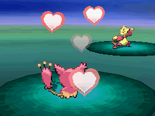
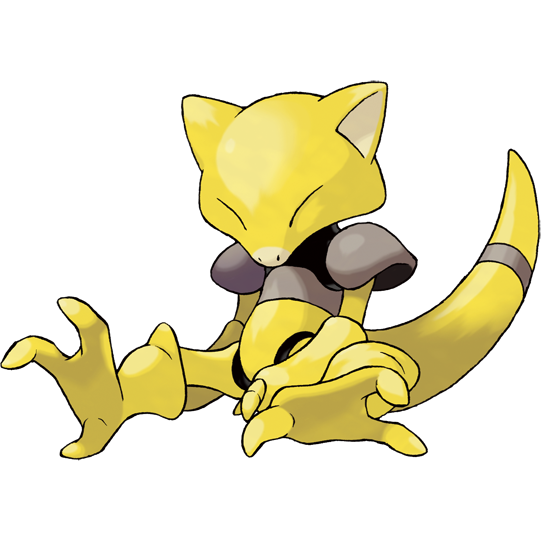

| **Rank** | **Pokemon** | **Move** |
|----------|-------------|----------|
| AAo | [Treecko](http://example.com/pikachu-info)  | [Thunderbolt](http://example.com/thunderbolt-info)  |
| AKo | [Torchic](http://example.com/pikachu-info)  | [Thunderbolt](http://example.com/thunderbolt-info)  |
| AQo | [Mudkip](http://example.com/pikachu-info)  | [Thunderbolt](http://example.com/thunderbolt-info)  |
| AJo | [Poochyena](http://example.com/pikachu-info)  | [Thunderbolt](http://example.com/thunderbolt-info)  |
| ATo | [Mightyena](http://example.com/pikachu-info)  | [Thunderbolt](http://example.com/thunderbolt-info)  |
| A9o | [Zigzagoon](http://example.com/pikachu-info)  | [Thunderbolt](http://example.com/thunderbolt-info)  |
| A8o | [Linoone](http://example.com/pikachu-info)  | [Thunderbolt](http://example.com/thunderbolt-info)  |
| A7o | [Wurmple](http://example.com/pikachu-info)  | [Thunderbolt](http://example.com/thunderbolt-info)  |
| A6o | [Beautifly](http://example.com/pikachu-info)  | [Thunderbolt](http://example.com/thunderbolt-info)  |
| A5o | [Dustox](http://example.com/pikachu-info)  | [Thunderbolt](http://example.com/thunderbolt-info)  |
| A4o | [Lotad](http://example.com/pikachu-info)  | [Thunderbolt](http://example.com/thunderbolt-info)  |
| A3o | [Lombre](http://example.com/pikachu-info)  | [Thunderbolt](http://example.com/thunderbolt-info)  |
| A2o | [Ludicolo](http://example.com/pikachu-info)  | [Thunderbolt](http://example.com/thunderbolt-info)  |
| KKo | [Seedot](http://example.com/pikachu-info)  | [Thunderbolt](http://example.com/thunderbolt-info)  |
| KQo | [Nuzleaf](http://example.com/pikachu-info)  | [Thunderbolt](http://example.com/thunderbolt-info)  |
| KJo | [Shiftry](http://example.com/pikachu-info)  | [Thunderbolt](http://example.com/thunderbolt-info)  |
| KTo | [Taillow](http://example.com/pikachu-info)  | [Thunderbolt](http://example.com/thunderbolt-info)  |
| K9o | [Swellow](http://example.com/pikachu-info)  | [Thunderbolt](http://example.com/thunderbolt-info)  |
| K8o | [Wingull](http://example.com/pikachu-info)  | [Thunderbolt](http://example.com/thunderbolt-info)  |
| K7o | [Pelipper](http://example.com/pikachu-info)  | [Thunderbolt](http://example.com/thunderbolt-info)  |
| K6o | [Ralts](http://example.com/pikachu-info)  | [Thunderbolt](http://example.com/thunderbolt-info)  |
| K5o | [Kirlia](http://example.com/pikachu-info)  | [Thunderbolt](http://example.com/thunderbolt-info)  |
| K4o | [Gardevoir](http://example.com/pikachu-info)  | [Thunderbolt](http://example.com/thunderbolt-info)  |
| K3o | [Surskit](http://example.com/pikachu-info)  | [Thunderbolt](http://example.com/thunderbolt-info)  |
| K2o | [Masquerain](http://example.com/pikachu-info)  | [Thunderbolt](http://example.com/thunderbolt-info)  |
| QQo | [Shroomish](http://example.com/pikachu-info)  | [Thunderbolt](http://example.com/thunderbolt-info)  |
| QJo | [Breloom](http://example.com/pikachu-info)  | [Thunderbolt](http://example.com/thunderbolt-info)  |
| QTo | [Slakoth](http://example.com/pikachu-info)  | [Thunderbolt](http://example.com/thunderbolt-info)  |
| Q9o | [Vigoroth](http://example.com/pikachu-info)  | [Thunderbolt](http://example.com/thunderbolt-info)  |
| Q8o | [Slaking](http://example.com/pikachu-info)  | [Thunderbolt](http://example.com/thunderbolt-info)  |
| Q7o | [Abra](http://example.com/pikachu-info)  | [Thunderbolt](http://example.com/thunderbolt-info)  |
| Q6o | [Kadabra](http://example.com/pikachu-info)  | [Thunderbolt](http://example.com/thunderbolt-info)  |
| Q5o | [Alakazam](http://example.com/pikachu-info)  | [Thunderbolt](http://example.com/thunderbolt-info)  |
| Q4o | [Nincada](http://example.com/pikachu-info)  | [Thunderbolt](http://example.com/thunderbolt-info)  |
| Q3o | [Ninjask](http://example.com/pikachu-info)  | [Thunderbolt](http://example.com/thunderbolt-info)  |
| Q2o | [Shedinja](http://example.com/pikachu-info)  | [Thunderbolt](http://example.com/thunderbolt-info)  |
| JJo | [Whismur](http://example.com/pikachu-info)  | [Thunderbolt](http://example.com/thunderbolt-info)  |
| JTo | [Loudred](http://example.com/pikachu-info)  | [Thunderbolt](http://example.com/thunderbolt-info)  |
| J9o | [Exploud](http://example.com/pikachu-info)  | [Thunderbolt](http://example.com/thunderbolt-info)  |
| J8o | [Makuhita](http://example.com/pikachu-info)  | [Thunderbolt](http://example.com/thunderbolt-info)  |
| J7o | [Hariyama](http://example.com/pikachu-info)  | [Thunderbolt](http://example.com/thunderbolt-info)  |
| J6o | [Goldeen](http://example.com/pikachu-info)  | [Thunderbolt](http://example.com/thunderbolt-info)  |
| J5o | [Seaking](http://example.com/pikachu-info)  | [Thunderbolt](http://example.com/thunderbolt-info)  |
| J4o | [Magikarp](http://example.com/pikachu-info)  | [Thunderbolt](http://example.com/thunderbolt-info)  |
| J3o | [Gyarados](http://example.com/pikachu-info)  | [Thunderbolt](http://example.com/thunderbolt-info)  |
| J2o | [Azurill](http://example.com/pikachu-info)  | [Thunderbolt](http://example.com/thunderbolt-info)  |
| TTo | [Marill](http://example.com/pikachu-info)  | [Thunderbolt](http://example.com/thunderbolt-info)  |
| T9o | [Azumarill](http://example.com/pikachu-info)  | [Thunderbolt](http://example.com/thunderbolt-info)  |
| T8o | [Geodude](http://example.com/pikachu-info)  | [Thunderbolt](http://example.com/thunderbolt-info)  |
| T7o | [Graveler](http://example.com/pikachu-info)  | [Thunderbolt](http://example.com/thunderbolt-info)  |
| T6o | [Golem](http://example.com/pikachu-info)  | [Thunderbolt](http://example.com/thunderbolt-info)  |
| T5o | [Nosepass](http://example.com/pikachu-info)  | [Thunderbolt](http://example.com/thunderbolt-info)  |
| T4o | [Skitty](http://example.com/pikachu-info)  | [Thunderbolt](http://example.com/thunderbolt-info)  |
| T3o | [Delcatty](http://example.com/pikachu-info)  | [Thunderbolt](http://example.com/thunderbolt-info)  |
| T2o | [Zubat](http://example.com/pikachu-info)  | [Thunderbolt](http://example.com/thunderbolt-info)  |
| 99o | [Golbat](http://example.com/pikachu-info)  | [Thunderbolt](http://example.com/thunderbolt-info)  |
| 98o | [Crobat](http://example.com/pikachu-info)  | [Thunderbolt](http://example.com/thunderbolt-info)  |
| 97o | [Tentacool](http://example.com/pikachu-info)  | [Thunderbolt](http://example.com/thunderbolt-info)  |
| 96o | [Tentacruel](http://example.com/pikachu-info)  | [Thunderbolt](http://example.com/thunderbolt-info)  |
| 95o | [Sableye](http://example.com/pikachu-info)  | [Thunderbolt](http://example.com/thunderbolt-info)  |
| 94o | [Mawile](http://example.com/pikachu-info)  | [Thunderbolt](http://example.com/thunderbolt-info)  |
| 93o | [Aron](http://example.com/pikachu-info)  | [Thunderbolt](http://example.com/thunderbolt-info)  |
| 92o | [Lairon](http://example.com/pikachu-info)  | [Thunderbolt](http://example.com/thunderbolt-info)  |
| 88o | [Aggron](http://example.com/pikachu-info)  | [Thunderbolt](http://example.com/thunderbolt-info)  |
| 87o | [Machop](http://example.com/pikachu-info)  | [Thunderbolt](http://example.com/thunderbolt-info)  |
| 86o | [Machoke](http://example.com/pikachu-info)  | [Thunderbolt](http://example.com/thunderbolt-info)  |
| 85o | [Machamp](http://example.com/pikachu-info)  | [Thunderbolt](http://example.com/thunderbolt-info)  |
| 84o | [Meditite](http://example.com/pikachu-info)  | [Thunderbolt](http://example.com/thunderbolt-info)  |
| 83o | [Medicham](http://example.com/pikachu-info)  | [Thunderbolt](http://example.com/thunderbolt-info)  |
| 82o | [Electrike](http://example.com/pikachu-info)  | [Thunderbolt](http://example.com/thunderbolt-info)  |
| 77o | [Manectric](http://example.com/pikachu-info)  | [Thunderbolt](http://example.com/thunderbolt-info)  |
| 76o | [Plusle](http://example.com/pikachu-info)  | [Thunderbolt](http://example.com/thunderbolt-info)  |
| 75o | [Minun](http://example.com/pikachu-info)  | [Thunderbolt](http://example.com/thunderbolt-info)  |
| 74o | [Magnemite](http://example.com/pikachu-info)  | [Thunderbolt](http://example.com/thunderbolt-info)  |
| 73o | [Magneton](http://example.com/pikachu-info)  | [Thunderbolt](http://example.com/thunderbolt-info)  |
| 72o | [Voltorb](http://example.com/pikachu-info)  | [Thunderbolt](http://example.com/thunderbolt-info)  |
| 66o | [Electrode](http://example.com/pikachu-info)  | [Thunderbolt](http://example.com/thunderbolt-info)  |
| 65o | [Volbeat](http://example.com/pikachu-info)  | [Thunderbolt](http://example.com/thunderbolt-info)  |
| 64o | [Illumise](http://example.com/pikachu-info)  | [Thunderbolt](http://example.com/thunderbolt-info)  |
| 63o | [Oddish](http://example.com/pikachu-info)  | [Thunderbolt](http://example.com/thunderbolt-info)  |
| 62o | [Gloom](http://example.com/pikachu-info)  | [Thunderbolt](http://example.com/thunderbolt-info)  |
| 55o | [Vileplume](http://example.com/pikachu-info)  | [Thunderbolt](http://example.com/thunderbolt-info)  |
| 54o | [Bellossom](http://example.com/pikachu-info)  | [Thunderbolt](http://example.com/thunderbolt-info)  |
| 53o | [Doduo](http://example.com/pikachu-info)  | [Thunderbolt](http://example.com/thunderbolt-info)  |
| 52o | [Dodrio](http://example.com/pikachu-info)  | [Thunderbolt](http://example.com/thunderbolt-info)  |
| 44o | [Roselia](http://example.com/pikachu-info)  | [Thunderbolt](http://example.com/thunderbolt-info)  |
| 43o | [Gulpin](http://example.com/pikachu-info)  | [Thunderbolt](http://example.com/thunderbolt-info)  |
| 42o | [Swalot](http://example.com/pikachu-info)  | [Thunderbolt](http://example.com/thunderbolt-info)  |
| 33o | [Carvanha](http://example.com/pikachu-info)  | [Thunderbolt](http://example.com/thunderbolt-info)  |
| 32o | [Sharpedo](http://example.com/pikachu-info)  | [Thunderbolt](http://example.com/thunderbolt-info)  |
| 22o | [Wailmer](http://example.com/pikachu-info)  | [Thunderbolt](http://example.com/thunderbolt-info)  |
