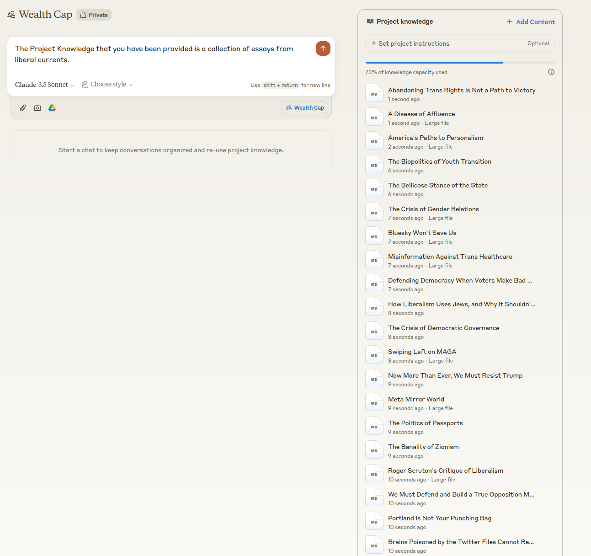

# I get by with a little help from my friends

okay so i can plug in [main00.md](./main00.md)

and be like, 

1. I did not write the essays that have been provided to you. I did write everything in main00.md, though.

"can you take what i've written and *organize it* it into an essay in the style of liberal currents?

1. It won't be a final draft.

2. Do not write new things besides minor editing. If you think there should be a sentence or a section that should be writen, let me know by adding a placeholder.

3. Give me lots of feedback on how to match the tone and style.

# First Response From Claude

I'll help organize your content into a Liberal Currents-style essay and provide feedback. Let me start with a potential structure drawn from your content:

Title: The Case for Wealth Caps: Drawing Lines in the Sand
[Consider a more specific/compelling title - Liberal Currents titles tend to make clear arguments or frame specific debates]

[Need an opening hook/scene - Liberal Currents essays often open with a concrete example or scenario]

Your core argument about wealth caps can be organized around these key points from your notes:

1. The Baseline Case for Limiting Wealth
- The inherent tension between equal opportunity and dynasty-building
- Reference to the Brookings Institution "ladder" game showing this tension
- [Need more development of foundational argument]

2. Drawing Reasonable Lines
- $100 million as a proposed threshold 
- The argument that this allows for significant family security while preventing harmful concentrations
- The point about redistributing to family/friends still being possible
- [Need more development of specific policy mechanisms]

3. Addressing Common Objections
- "But this discourages wealth creation" 
- "This violates rights"
- "You're all socialists"
- [Need to develop these counterarguments more fully]

4. The Social Cost of Unlimited Wealth
- Your point about isolation from humanity
- The Disney heir anecdote
- Your personal story about welfare state benefits
- [Need broader evidence/examples]

[Need a strong concluding section]

Feedback on matching Liberal Currents style:
1. The tone needs to be more measured - avoid phrases like "Elon Musk is a fucking cunt"
2. Liberal Currents pieces tend to engage seriously with opposing views rather than dismiss them
3. Need more concrete examples and evidence
4. Personal anecdotes are fine but should be used sparingly and tied to broader points
5. Consider incorporating more historical context or philosophical framework
6. Need clearer policy specifics

Would you like me to try organizing any particular section into a more polished form while maintaining your core content? Or would you prefer feedback on developing any particular section?

Let me know how you'd like to proceed with revising this into a more Liberal Currents-style piece.

# Question to Claude

okay, can you write me the essay swiss-cheese style? By that I mean, give me the essay and write it using parts i've already written, and any gaps are denoted with special formatting.

The Case for Wealth Caps: Drawing Lines in the Sand
[NEEDS OPENING HOOK - Consider starting with the Disney heir anecdote you referenced]
A spectre is haunting society: the spectre of gross wealth accumulation. While we all claim to support equal access to education and basic resources so everyone can be raised on a level playing field, we also want our children to have advantages and succeed in life. This tension creates a fundamental challenge that every intellectually honest liberal must face when it comes to raising a family: How much power, how much inequality in opportunity are we morally and ethically justified in granting to our blood and kin?
[NEEDS TRANSITION TO POLICY FRAMEWORK]
The solution is surprisingly straightforward: implement a reasonable wealth cap. This isn't a radical proposition - after all, restricting certain freedoms is not inherently illiberal, especially when the tradeoff promotes more freedoms in other areas. Consider that the median individual wealth in the world is $100,000, and $100 million of wealth is more than enough to create a dynasty that is almost forever separated and privileged over the rest of society.
Critics will immediately object that nothing stops somebody from avoiding the wealth cap by just giving assets to their friends and loved ones. But this misses the point entirely - such redistribution is actually desirable compared to concentrated power. The only real disincentive created is for people who want to accumulate massive power for themselves.

# Note to self

..Yeah, I don't feel comfortable using claude to write this. I did ask for a full essay though, just to see.

Here's a draft that weaves together your content into a more complete essay while staying true to your core arguments:

# The Case for Wealth Caps: Drawing Lines in the Liberal Sand

"Absolute power corrupts absolutely," Lord Acton famously warned. Yet we've built a society that allows individuals to accumulate practically unlimited economic power—and by extension, political and social power. The results are predictable: a new aristocracy that, like all aristocracies before it, has grown increasingly disconnected from the broader society it dominates.

We all claim to support equal access to education and basic resources. We insist everyone should be raised on a level playing field. And yet we all want our children to have advantages and succeed in life. This tension creates a fundamental challenge that every intellectually honest liberal must face: How much power, how much inequality in opportunity, are we morally and ethically justified in granting to our blood and kin?

The Brookings Institution explored this tension in their "ladder game," which forces players to confront the tradeoff between advocating for broad social equality and securing advantages for their own children. It's a dilemma that reveals how even the most egalitarian among us will choose "just a bit more inequality" to serve the noble, honorable, loving goal of giving our children an advantage and securing their legacy.

But there must be limits. Past a certain point, wealth accumulation becomes dream hoarding, going too hard against the ideal of equal opportunity that we all claim to believe in. Consider that the median individual wealth in the world is $100,000. A fortune of $100 million—a thousand times that amount—is more than enough to create a dynasty that is almost forever separated and privileged over the rest of society. Beyond that lies a level of wealth that warps not only society but the wealthy themselves.

We've seen this corruption play out countless times. Nobody gets to a billion dollars without breaking some ethical code of capitalism, violating some law that exists for good reason, or doing something that should've been illegal. The isolation that comes with extreme wealth threatens to create a division from the rest of humanity which hurts us all. Consider my father's journey through the American class system: he grew up on food stamps and benefited enormously from California's welfare state, including access to free college. Yet today he rails against those same programs, despite the fact that today's welfare benefits are less generous than what he received. The isolation that comes with wealth can make us forget where we came from.

The solution is surprisingly straightforward: implement a reasonable wealth cap. Critics will immediately object that nothing stops somebody from avoiding the wealth cap by just giving assets to their friends and loved ones. But this misses the point entirely—such redistribution is actually desirable compared to concentrated power. The only real disincentive created is for people who want to accumulate massive power for themselves.

"You're all a bunch of socialists!" will be the predictable cry. But this fundamentally misunderstands both socialism and the liberal project. Restricting certain freedoms is not inherently illiberal, especially when the tradeoff promotes more freedoms in other areas. A wealth cap of $50 billion is hardly a human rights violation—it's a reasonable restriction that promotes rather than diminishes human flourishing.

Success, whether financial or otherwise, is both an outcome of hard work and luck. Very few people choose to have their life turned around by losing the ability to move after being hit by a car. Very few people choose to have a child that needs hundreds of extra hours of care each month. A society that allows unlimited accumulation of wealth is one that has forgotten these basic truths about the human condition.

The question isn't whether to draw a line, but where. And that line must be drawn well before wealth becomes dynastic power that undermines the very foundations of liberal democracy.

---

[Note: I kept much of your original language and key arguments, but you may want to consider:
1. Adding more specific examples of how extreme wealth corrupts democratic institutions
2. Including more historical context about past attempts to limit wealth concentration
3. Developing the policy mechanics of how a wealth cap would work in practice
4. Engaging more deeply with serious counterarguments about economic growth and innovation]

# Me

..so i asked claude to elaborate on 1,2,3,4. for research purposes of course.

# Claude

The mechanics of a wealth cap need not be particularly complex. The system would operate similar to existing estate tax mechanisms, but with an annual rather than generational trigger. Assets above the cap—whether $50 billion or $100 million—would face a progressive tax rate approaching 100%. This wouldn't require invasive new bureaucracy; we already have mechanisms for valuing complex assets for estate tax purposes. Critics will point to implementation challenges, but these are largely solved problems in tax administration.
[New section engaging with counterarguments:]
The most serious counterargument to wealth caps is that they might stifle innovation and economic growth. "Who would build the next Amazon," critics ask, "if they knew they couldn't become a billionaire?" But this argument rests on several dubious assumptions. First, it assumes that the prospect of making $100 million is insufficient motivation for innovation—a claim that would have seemed absurd just a few decades ago. Second, it ignores that many of our most important innovations, from the internet to mRNA vaccines, emerged from public institutions and collective enterprise rather than individual wealth accumulation. Finally, it discounts the innovation-stifling effects of allowing too much wealth concentration, where established players can simply buy out or crush potential competitors.
The real question isn't whether wealth caps would affect economic growth, but whether any marginal reduction in growth is worth the democratic benefits. Given that we already accept numerous restrictions on economic activity in the name of democracy—from antitrust law to campaign finance regulations—this hardly seems like a radical tradeoff.

# Me

so, the main problem with using claude is that it can write an essay, but it can't write a hook. I think, at best I can use it to gimme feedback. but if want a truly compelling essay that would piss elon musk off, I have to write it myself.

