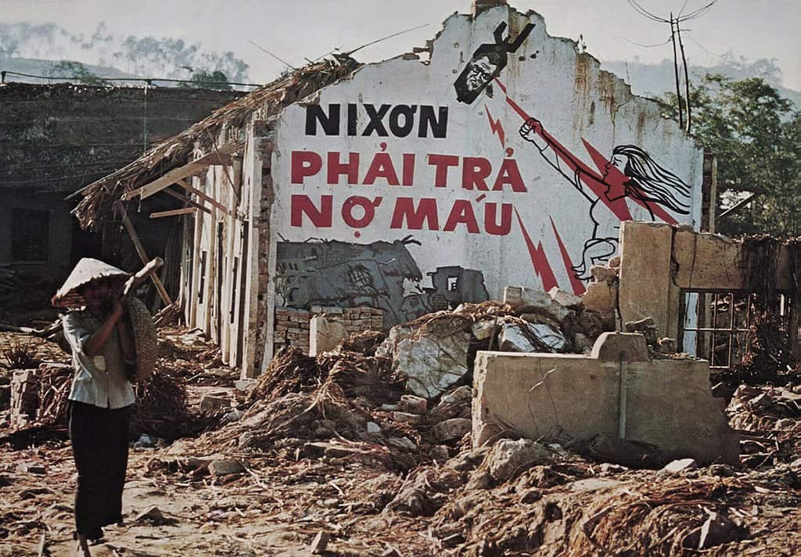

# Against Wealth

> **Government Employee:** S-sir, I'm afraid you've gone mad with power...  
> **Russ Cargill:** Of course I have. You ever tried going mad without power? It's boring. No one listens to you!  
>
> — [*The Simpsons Movie (2007)*](https://www.youtube.com/watch?v=zoZRdnHeeYg)

## The Hypocrisy of Liberalism

> *The people of old Mississippi*  
> *Should all hang their heads in shame*  
> *I can't understand how their minds work*  
> *What's the matter don't they watch Les Crain?*  
> *But if you ask me to bus my children*  
> *I hope the cops take down your name*  
> *So love me, love me, love me, I'm a liberal*  
>
> — *Pete Seeger*, [*"Love Me, I'm a Liberal"*](https://www.youtube.com/watch?v=3cdqQ2BdgOA)

- The inherent tension between equal opportunity and dynasty-building
- Reference to the Brookings Institution "ladder" game showing this tension
- [Need more development of foundational argument]

## The Interpersonal Cost of Unlimited Wealth

- Your point about isolation from humanity
- The Disney heir anecdote
- Your personal story about welfare state benefits
- [Need broader evidence/examples]

> “[H]aving a jet is a really big deal. [...] You don’t have to go through an airport terminal,  
> you don’t have to interact, you don’t have to be patient, you don’t have to be uncomfortable.  
> These are the things that remind us we’re human.”  
>
> — Abigail Disney, interview with *[The Cut](https://www.cnbc.com/2019/04/02/why-abigail-disney-says-she-would-pass-a-law-against-private-jets.html)*

## The Personal Cost of Unlimited Wealth

> *How much a dollar really cost?*  
> *The question is detrimental, paralyzin' my thoughts*  
> *Parasites in my stomach keep me with a gut feeling, y'all*  
> *Gotta see how I'm chillin' once I park this luxury car*  
>
> — *Kendrick Lamar,* [*"How Much a Dollar Cost,"* *To Pimp a Butterfly (2015)*](https://www.youtube.com/watch?v=y8kEiL81_R4)

## The Psychological Cost of Unlimited Wealth

> *Well, maybe I'm the faggot, America*  https://www.youtube.com/watch?v=gERJjsDhe0g
> *I'm not a part of a redneck agenda*  
> *Now everybody, do the propaganda*  
> *And sing along to the age of paranoia*  
>
> — *Green Day,* [*"American Idiot"*](https://www.youtube.com/watch?v=Ee_uujKuJMI)

## The Social Cost of Unlimited Wealth

> *So, you've been to school for a year or two*  
> *And you know you've seen it all*  
> *In daddy's car, thinkin' you'll go far*  
> *Back east, your type don't crawl*  
> *Play ethnicky jazz to parade your snazz*  
> *On your five-grand stereo*  
> *Braggin' that you know how the n*****s feel cold*  
> *And the slums got so much soul*  
>
> — *Dead Kennedys,* [*"Holiday in Cambodia"*](https://www.youtube.com/watch?v=v0Uc6ZWDF3c)

## Drawing Reasonable Lines

> *No one man should have all that power*  
> *The clock's ticking, I just count the hours*  
> *Stop tripping, I'm tripping off the power*  
>
> — *Kanye West,* [*"POWER"*](https://www.youtube.com/watch?v=L53gjP-TtGE)

## Addressing Common Objections

> *But wait, how am I a villain?*  
> *I give annually to UNICEF*  
> *And just last week I helped a lady cross the street*  
> *Who was super old and deaf*  
>
> — *Crazy Ex-Girlfriend,* [*"I'm the Villain in My Own Story"*](https://www.youtube.com/watch?v=UhzN7SfnNeY)

- "But this discourages wealth creation" 
- "This violates rights"
- "You're all socialists"
- [Need to develop these counterarguments more fully]

## Conclusion

> *When I reached into my pocket, I worriedly counted each note*  
> *Khi tôi rờ vô túi nỗi lo tôi đếm từng tờ*  
>  
> *Yet I can't count all my dreams (!)*  
> *Vậy mà đếm không hết ước mơ (!)*  
>  
> *Sometimes there's no beef noodle soup to fill you up*  
> *Đôi khi không có bún bò cho mày no nê*  
>  
> *Sweat, sweat, hunger, instant noodles are fine*  
> *Mồ hôi mồ kê đói mì gói cũng ô kê*  
>  
> — *Suboi,* [*"Cho Không"*](https://www.youtube.com/watch?v=gERJjsDhe0g)  
> *(English translation included)*
